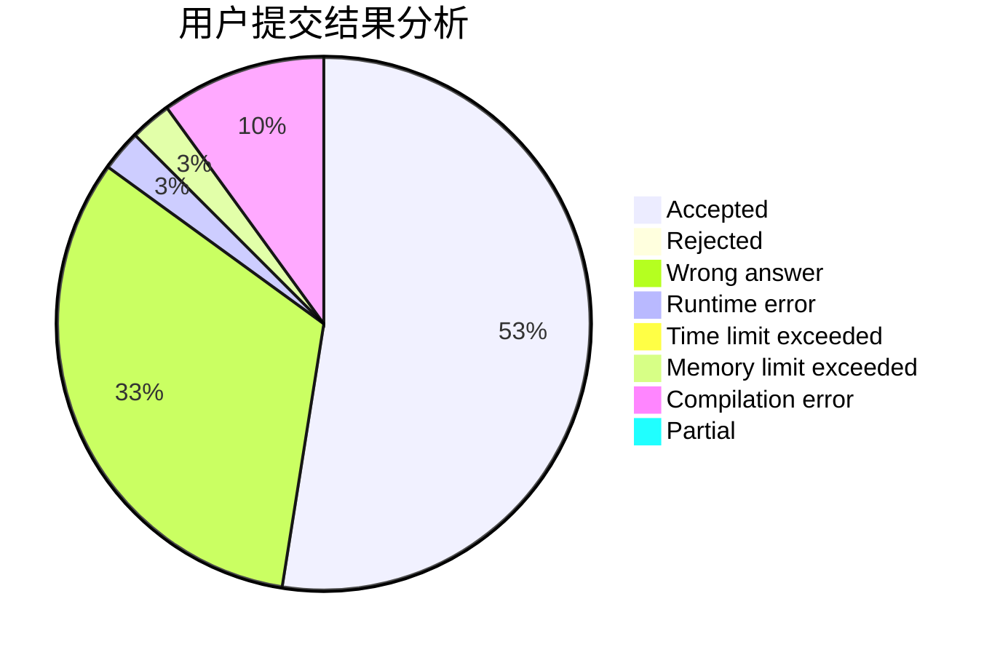
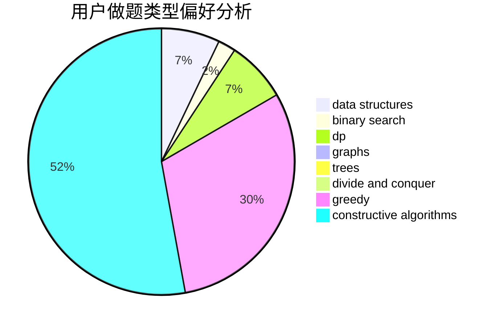

# youyou2005

<!-- tabs:start -->

#### **用户提交结果分析**

#### **用户做题类型偏好分析**

#### **用户错题知识点分析**

<!-- tabs:end -->
# 推荐题目
[979B](https://codeforces.com/contest/979/problem/B)		greedy		  
[1434D](https://codeforces.com/contest/1434/problem/D)		dsu,graphs,sortings,trees		  
[982D](https://codeforces.com/contest/982/problem/D)		brute force,
                        data structures,
                        dsu,
                        trees		  
[923B](https://codeforces.com/contest/923/problem/B)		binary search,
                        data structures		  
[1250I](https://codeforces.com/contest/1250/problem/I)		binary search,
                        brute force,
                        greedy,
                        shortest paths		  
[228D](https://codeforces.com/contest/228/problem/D)		data structures		  
[27B](https://codeforces.com/contest/27/problem/B)		bitmasks,
                        brute force,
                        dfs and similar,
                        greedy		  
[949A](https://codeforces.com/contest/949/problem/A)		greedy		  
[716A](https://codeforces.com/contest/716/problem/A)		implementation		  
[1357D5](https://codeforces.com/contest/1357D/problem/5)		nan		  
