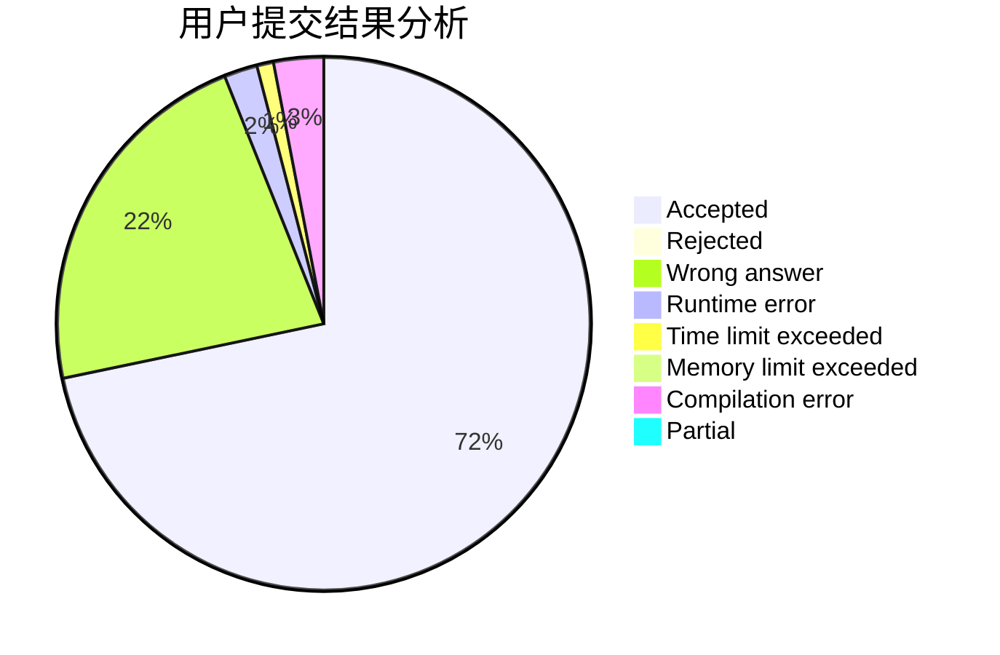
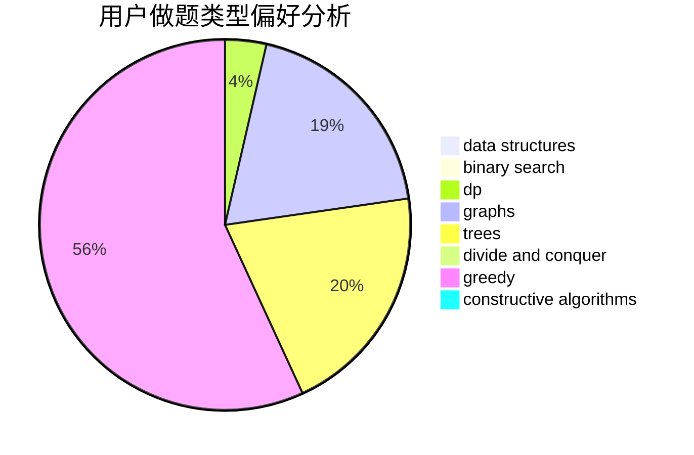
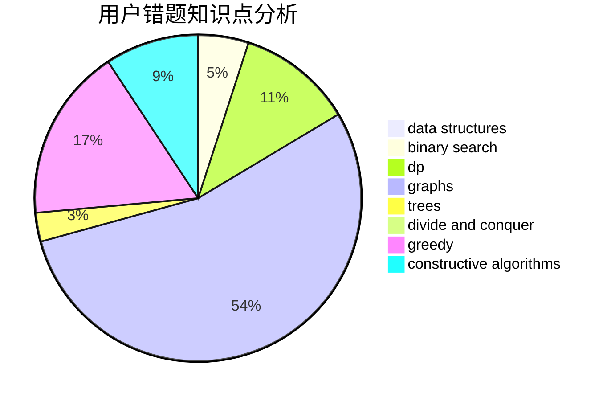

# ypcaeh

<!-- tabs:start -->

#### **用户提交结果分析**

#### **用户做题类型偏好分析**

#### **用户错题知识点分析**

<!-- tabs:end -->
# 推荐题目
[615D](https://codeforces.com/contest/615/problem/D)		math,
                        number theory		  
[1337A](https://codeforces.com/contest/1337/problem/A)		constructive algorithms,
                        math		  
[501C](https://codeforces.com/contest/501/problem/C)		constructive algorithms,
                        data structures,
                        greedy,
                        sortings,
                        trees		  
[339D](https://codeforces.com/contest/339/problem/D)		data structures,
                        trees		  
[954B](https://codeforces.com/contest/954/problem/B)		implementation,
                        strings		  
[1209F](https://codeforces.com/contest/1209/problem/F)		data structures,
                        dfs and similar,
                        graphs,
                        shortest paths,
                        strings,
                        trees		  
[746B](https://codeforces.com/contest/746/problem/B)		implementation,
                        strings		  
[383D](https://codeforces.com/contest/383/problem/D)		dp		  
[1086A](https://codeforces.com/contest/1086/problem/A)		dsu,graphs,sortings,trees		  
[101B](https://codeforces.com/contest/101/problem/B)		binary search,
                        data structures,
                        dp		  
