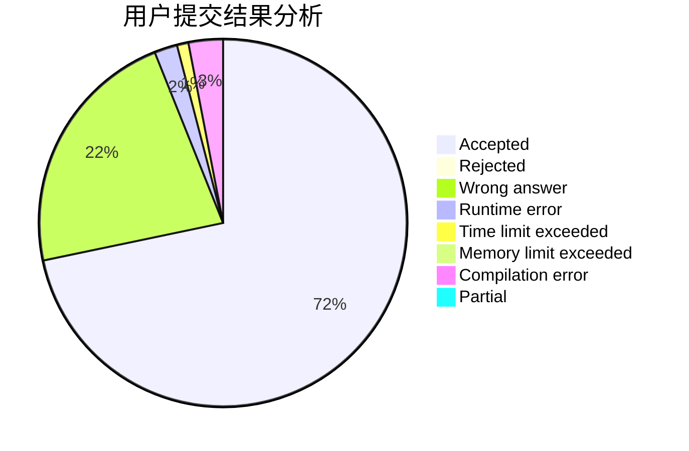
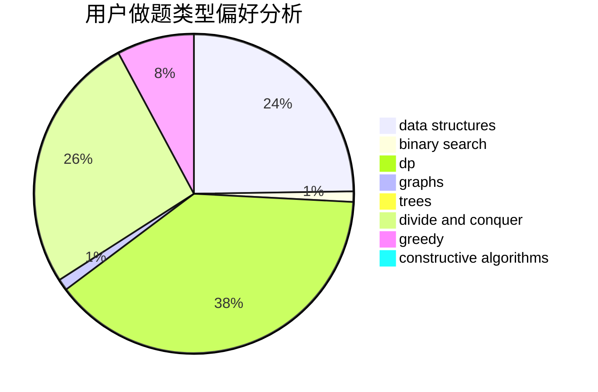
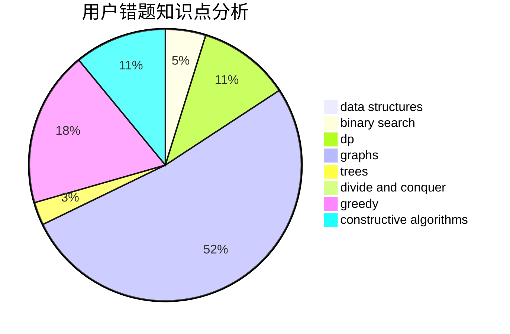

# ypcaeh

<!-- tabs:start -->

#### **用户提交结果分析**

#### **用户做题类型偏好分析**

#### **用户错题知识点分析**

<!-- tabs:end -->
# 推荐题目
[598A](https://codeforces.com/contest/598/problem/A)		math		  
[1331B](https://codeforces.com/contest/1331/problem/B)		math,
                        number theory		  
[482D](https://codeforces.com/contest/482/problem/D)		combinatorics,
                        dp,
                        trees		  
[315C](https://codeforces.com/contest/315/problem/C)		dsu,graphs,sortings,trees		  
[932B](https://codeforces.com/contest/932/problem/B)		binary search,
                        data structures,
                        dfs and similar		  
[1205C](https://codeforces.com/contest/1205/problem/C)		implementation,
                        interactive		  
[729B](https://codeforces.com/contest/729/problem/B)		dp,
                        implementation		  
[358B](https://codeforces.com/contest/358/problem/B)		brute force,
                        strings		  
[1085D](https://codeforces.com/contest/1085/problem/D)		constructive algorithms,
                        implementation,
                        trees		  
[1019C](https://codeforces.com/contest/1019/problem/C)		constructive algorithms,
                        graphs		  
