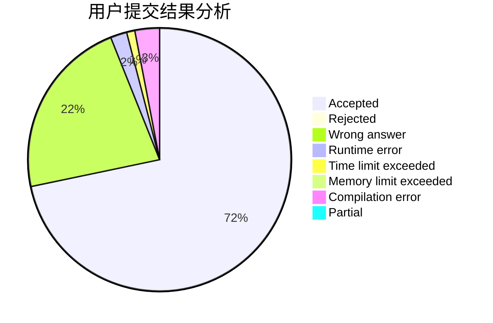
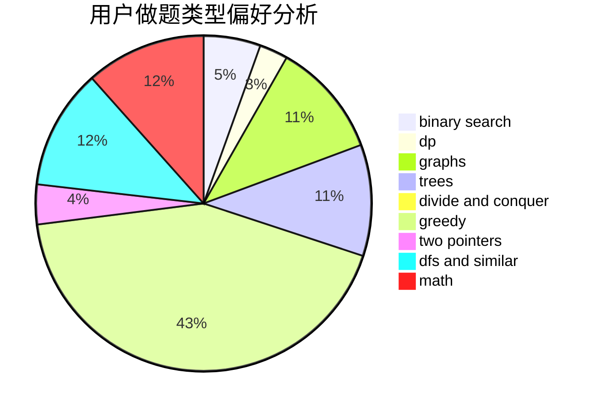

# ypcaeh

<!-- tabs:start -->

#### **用户提交结果分析**

#### **用户做题类型偏好分析**

<!-- tabs:end -->
# 推荐题目
[615D](https://codeforces.com/contest/615/problem/D)
[1337A](https://codeforces.com/contest/1337/problem/A)
[501C](https://codeforces.com/contest/501/problem/C)
[339D](https://codeforces.com/contest/339/problem/D)
[954B](https://codeforces.com/contest/954/problem/B)
[1209F](https://codeforces.com/contest/1209/problem/F)
[746B](https://codeforces.com/contest/746/problem/B)
[383D](https://codeforces.com/contest/383/problem/D)
[1086A](https://codeforces.com/contest/1086/problem/A)
[101B](https://codeforces.com/contest/101/problem/B)
