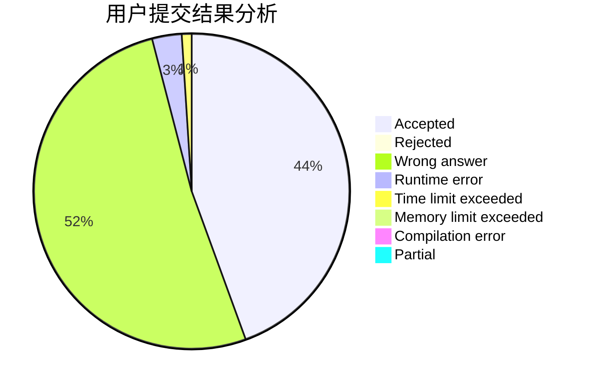
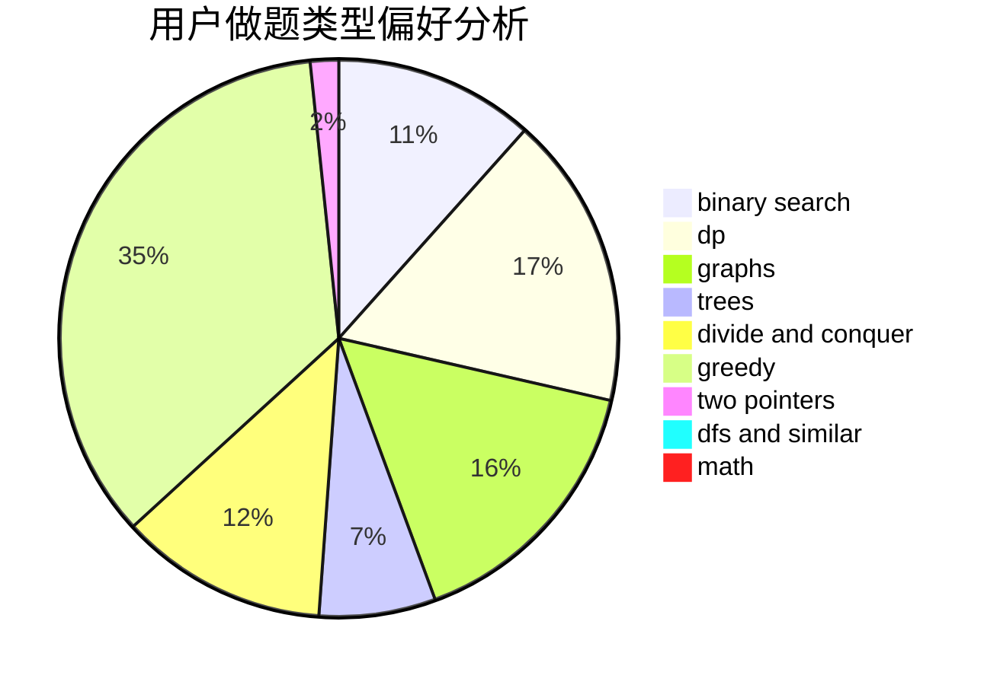

# Charonxu

<!-- tabs:start -->

#### **用户提交结果分析**

#### **用户做题类型偏好分析**

<!-- tabs:end -->
# 推荐题目
[1043E](https://codeforces.com/contest/1043/problem/E)
[1245C](https://codeforces.com/contest/1245/problem/C)
[519D](https://codeforces.com/contest/519/problem/D)
[163A](https://codeforces.com/contest/163/problem/A)
[671A](https://codeforces.com/contest/671/problem/A)
[1169A](https://codeforces.com/contest/1169/problem/A)
[1178C](https://codeforces.com/contest/1178/problem/C)
[409B](https://codeforces.com/contest/409/problem/B)
[437B](https://codeforces.com/contest/437/problem/B)
[1016F](https://codeforces.com/contest/1016/problem/F)
