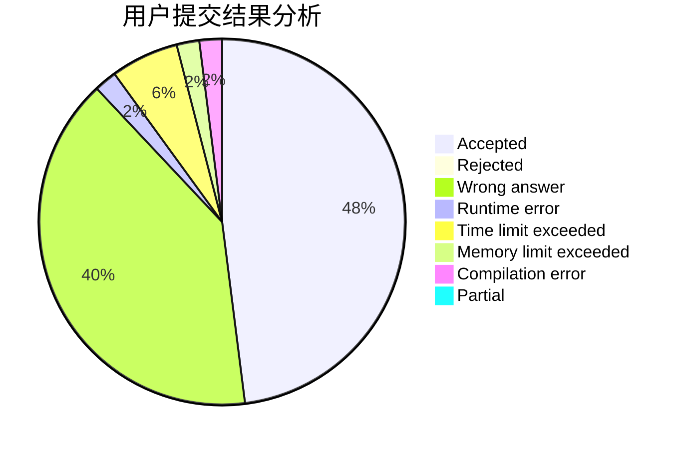
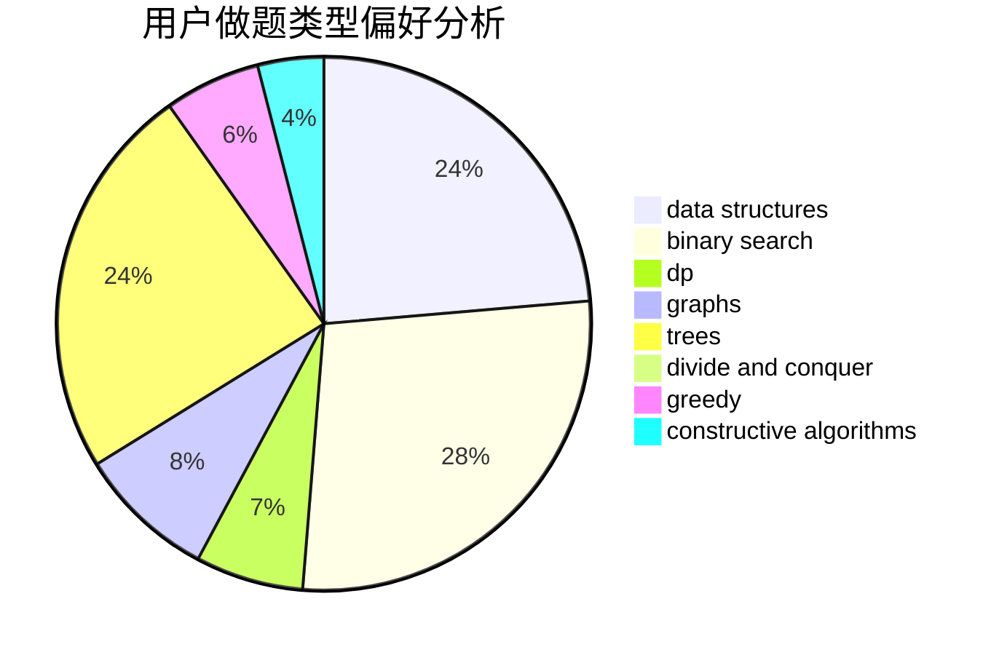
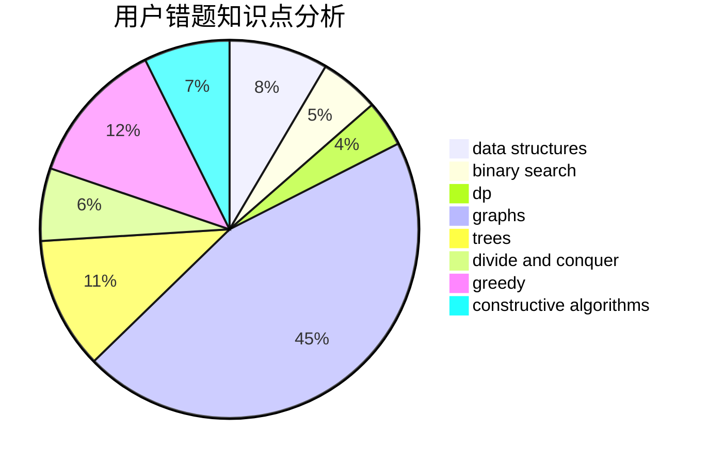

# yqaty

<!-- tabs:start -->

#### **用户提交结果分析**

#### **用户做题类型偏好分析**

#### **用户错题知识点分析**

<!-- tabs:end -->
# 推荐题目
[1088B](https://codeforces.com/contest/1088/problem/B)		implementation,
                        sortings		  
[314C](https://codeforces.com/contest/314/problem/C)		data structures,
                        dp		  
[821B](https://codeforces.com/contest/821/problem/B)		brute force,
                        math		  
[189B](https://codeforces.com/contest/189/problem/B)		brute force,
                        math		  
[718E](https://codeforces.com/contest/718/problem/E)		bitmasks,
                        graphs		  
[959B](https://codeforces.com/contest/959/problem/B)		dsu,
                        greedy,
                        implementation		  
[1197B](https://codeforces.com/contest/1197/problem/B)		greedy,
                        implementation		  
[730I](https://codeforces.com/contest/730/problem/I)		dp,
                        flows,
                        graphs,
                        greedy		  
[498B](https://codeforces.com/contest/498/problem/B)		dp,
                        probabilities,
                        two pointers		  
[630C](https://codeforces.com/contest/630/problem/C)		combinatorics,
                        math		  
