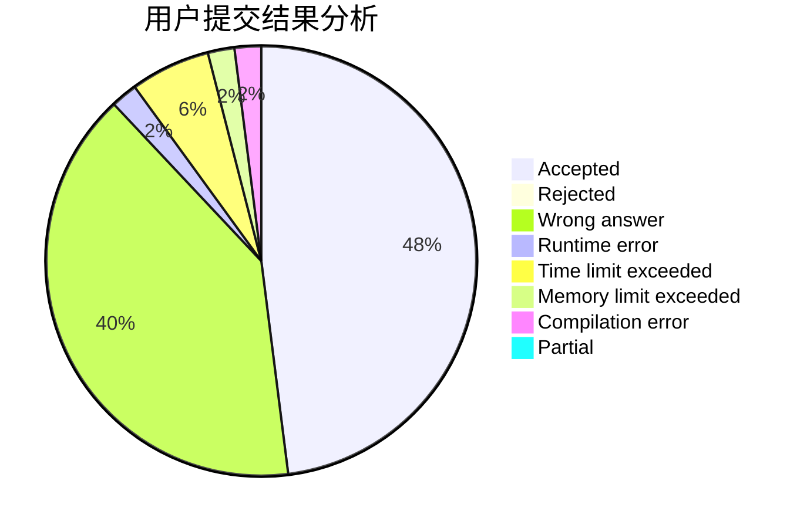
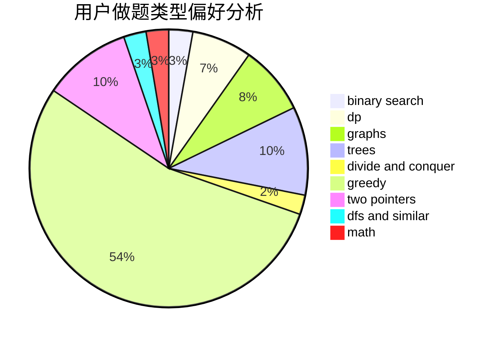

# yqaty

<!-- tabs:start -->

#### **用户提交结果分析**

#### **用户做题类型偏好分析**

<!-- tabs:end -->
# 推荐题目
[1088E](https://codeforces.com/contest/1088/problem/E)
[339B](https://codeforces.com/contest/339/problem/B)
[841A](https://codeforces.com/contest/841/problem/A)
[213C](https://codeforces.com/contest/213/problem/C)
[736A](https://codeforces.com/contest/736/problem/A)
[981A](https://codeforces.com/contest/981/problem/A)
[1200D](https://codeforces.com/contest/1200/problem/D)
[748D](https://codeforces.com/contest/748/problem/D)
[518F](https://codeforces.com/contest/518/problem/F)
[660A](https://codeforces.com/contest/660/problem/A)
