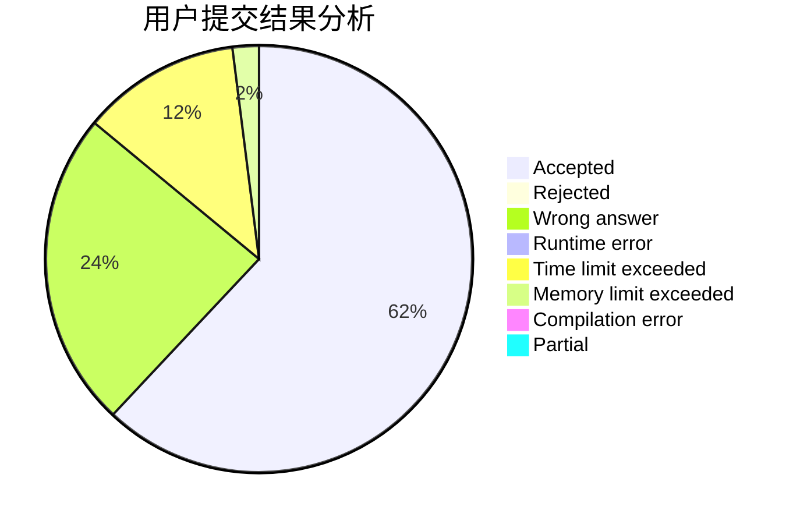
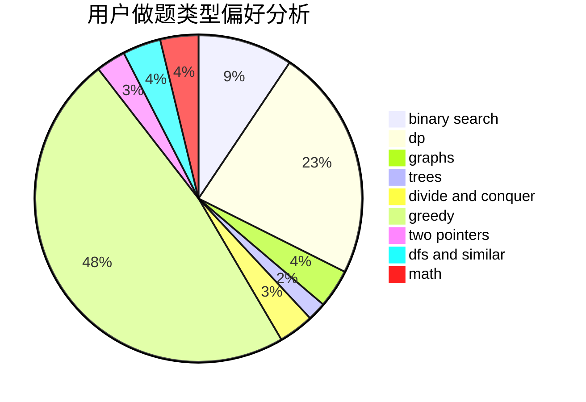

# yqingping

<!-- tabs:start -->

#### **用户提交结果分析**

#### **用户做题类型偏好分析**

<!-- tabs:end -->
# 推荐题目
[638A](https://codeforces.com/contest/638/problem/A)
[304C](https://codeforces.com/contest/304/problem/C)
[13764](https://codeforces.com/contest/1376/problem/4)
[845A](https://codeforces.com/contest/845/problem/A)
[376A](https://codeforces.com/contest/376/problem/A)
[117C](https://codeforces.com/contest/117/problem/C)
[383E](https://codeforces.com/contest/383/problem/E)
[939E](https://codeforces.com/contest/939/problem/E)
[114B](https://codeforces.com/contest/114/problem/B)
[379D](https://codeforces.com/contest/379/problem/D)
