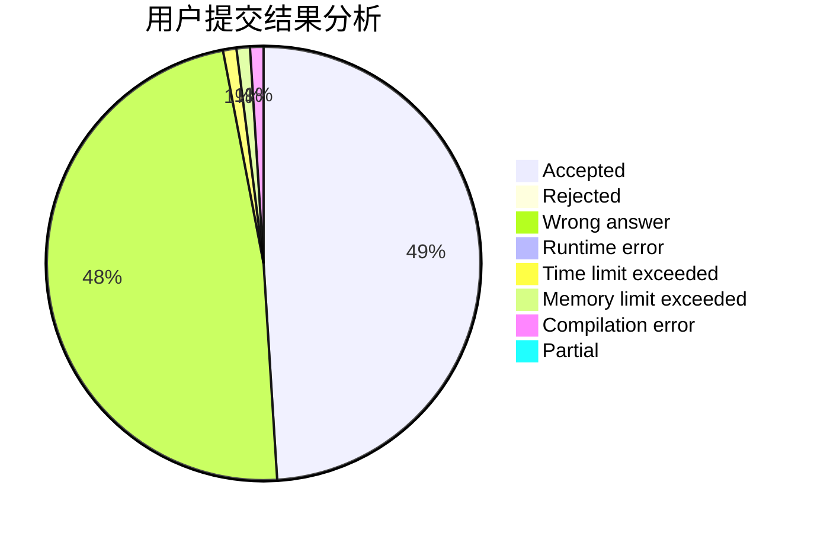
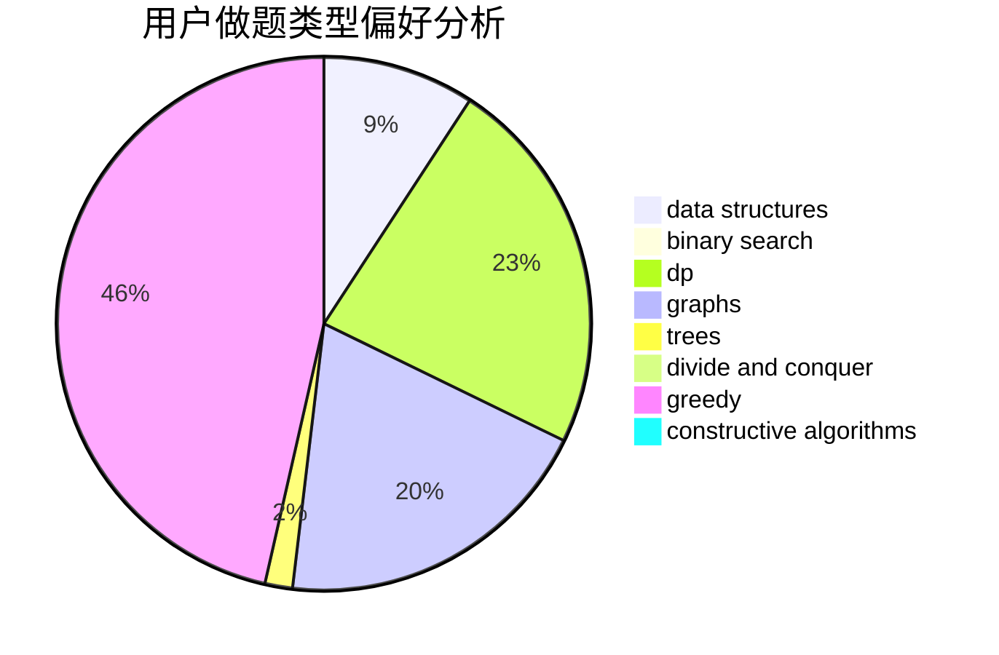

# ysj1173886760

<!-- tabs:start -->

#### **用户提交结果分析**

#### **用户做题类型偏好分析**

#### **用户错题知识点分析**

<!-- tabs:end -->
# 推荐题目
[903A](https://codeforces.com/contest/903/problem/A)		greedy,
                        implementation		  
[13571](https://codeforces.com/contest/1357/problem/1)		dsu,graphs,sortings,trees		  
[551B](https://codeforces.com/contest/551/problem/B)		brute force,
                        constructive algorithms,
                        implementation,
                        strings		  
[1496F](https://codeforces.com/contest/1496/problem/F)		dsu,graphs,sortings,trees		  
[1000G](https://codeforces.com/contest/1000/problem/G)		data structures,
                        dp,
                        trees		  
[1322E](https://codeforces.com/contest/1322/problem/E)		data structures		  
[1237H](https://codeforces.com/contest/1237/problem/H)		constructive algorithms		  
[325A](https://codeforces.com/contest/325/problem/A)		implementation		  
[286E](https://codeforces.com/contest/286/problem/E)		constructive algorithms,
                        fft,
                        math		  
[887A](https://codeforces.com/contest/887/problem/A)		implementation		  
