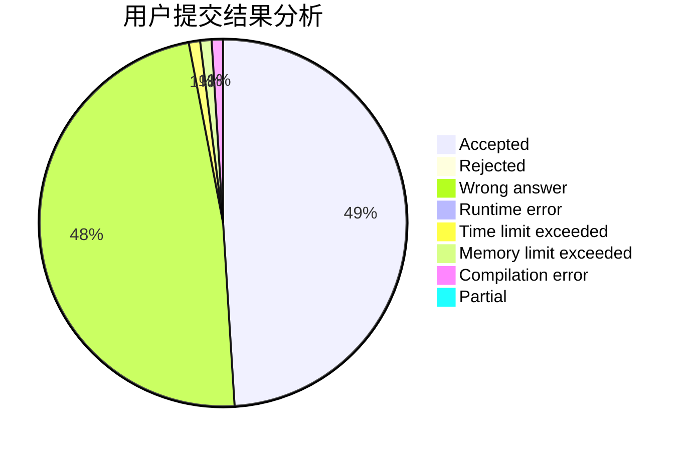
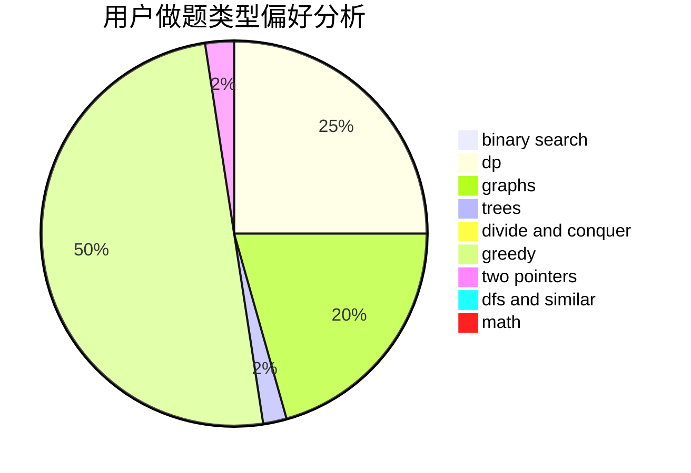

# ysj1173886760

<!-- tabs:start -->

#### **用户提交结果分析**

#### **用户做题类型偏好分析**

<!-- tabs:end -->
# 推荐题目
[903A](https://codeforces.com/contest/903/problem/A)
[13571](https://codeforces.com/contest/1357/problem/1)
[551B](https://codeforces.com/contest/551/problem/B)
[1496F](https://codeforces.com/contest/1496/problem/F)
[1000G](https://codeforces.com/contest/1000/problem/G)
[1322E](https://codeforces.com/contest/1322/problem/E)
[1237H](https://codeforces.com/contest/1237/problem/H)
[325A](https://codeforces.com/contest/325/problem/A)
[286E](https://codeforces.com/contest/286/problem/E)
[887A](https://codeforces.com/contest/887/problem/A)
