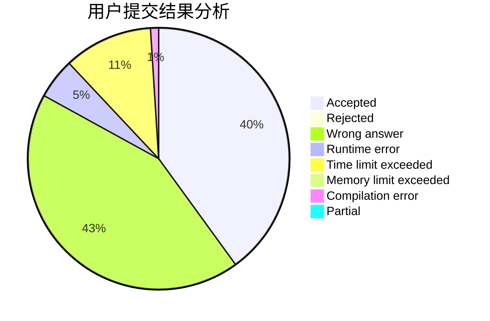
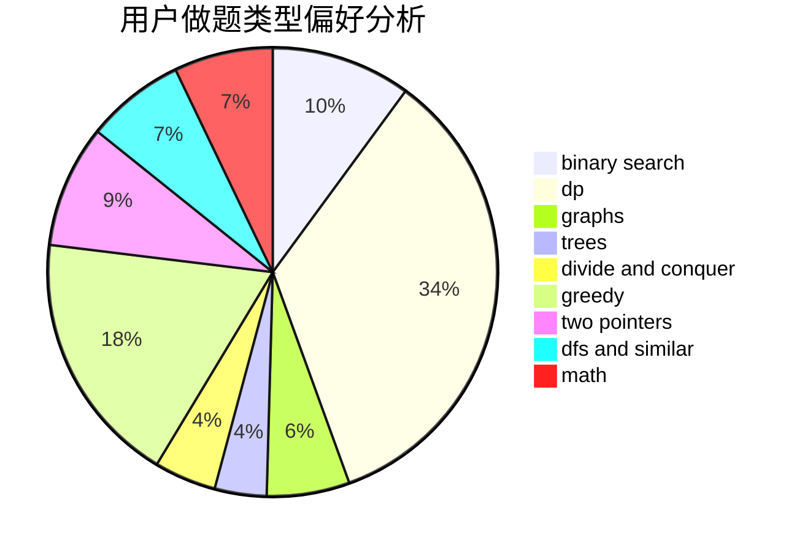

# yspm

<!-- tabs:start -->

#### **用户提交结果分析**

#### **用户做题类型偏好分析**

<!-- tabs:end -->
# 推荐题目
[1466G](https://codeforces.com/contest/1466/problem/G)
[1325B](https://codeforces.com/contest/1325/problem/B)
[818D](https://codeforces.com/contest/818/problem/D)
[838E](https://codeforces.com/contest/838/problem/E)
[514B](https://codeforces.com/contest/514/problem/B)
[295A](https://codeforces.com/contest/295/problem/A)
[856C](https://codeforces.com/contest/856/problem/C)
[11881](https://codeforces.com/contest/1188/problem/1)
[1300E](https://codeforces.com/contest/1300/problem/E)
[893A](https://codeforces.com/contest/893/problem/A)
