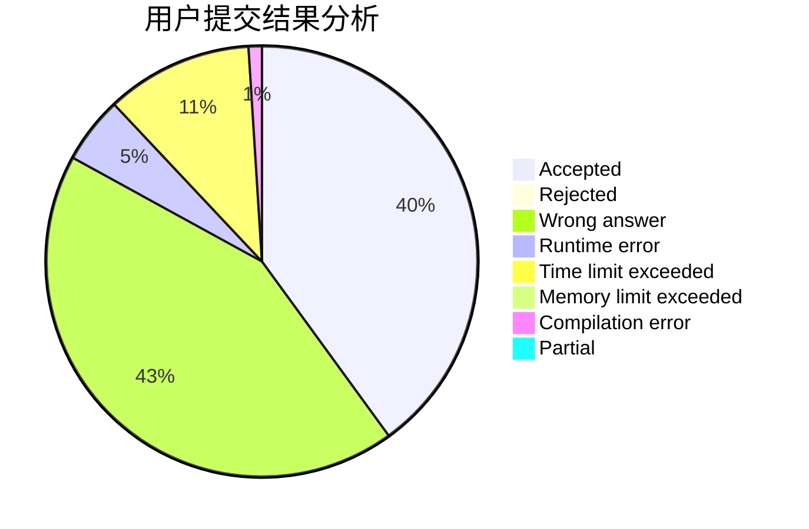
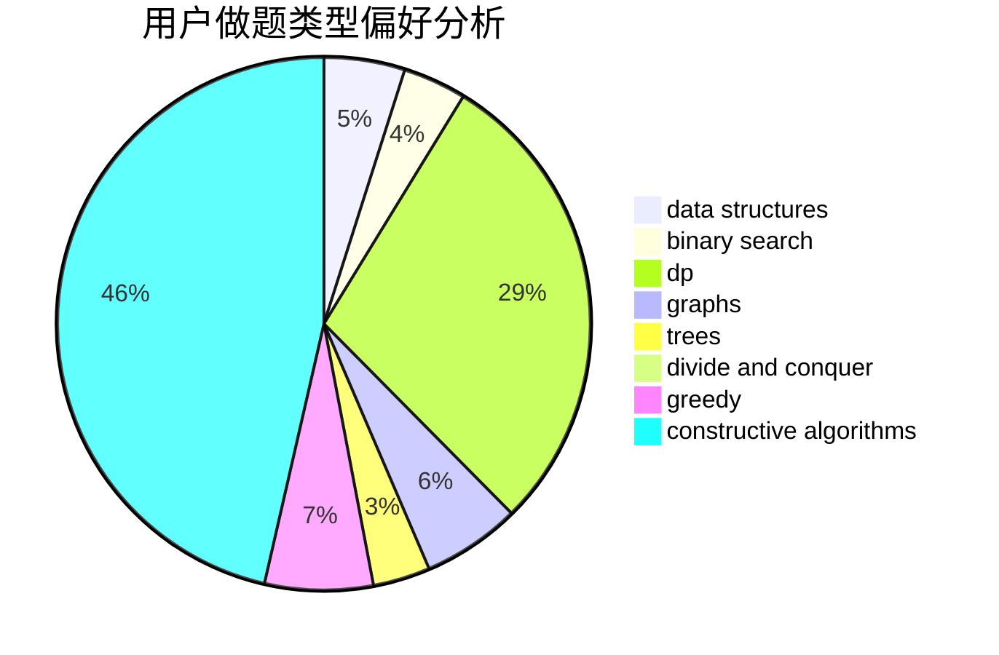
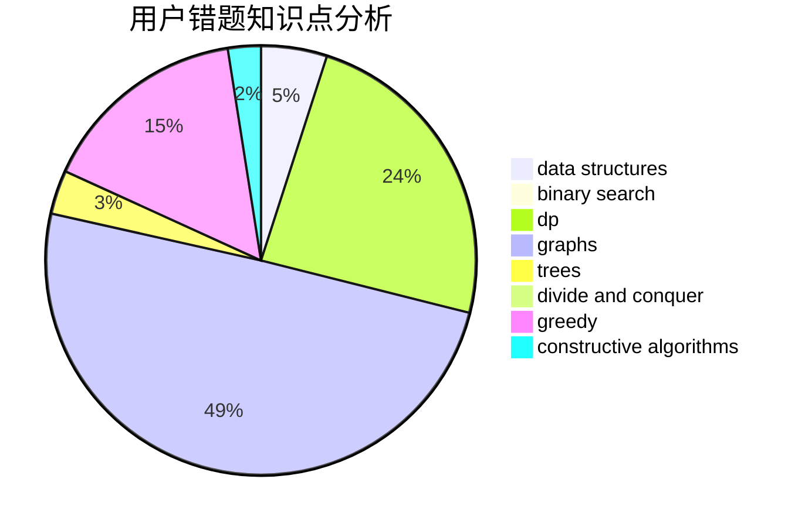

# yspm

<!-- tabs:start -->

#### **用户提交结果分析**

#### **用户做题类型偏好分析**

#### **用户错题知识点分析**

<!-- tabs:end -->
# 推荐题目
[1466G](https://codeforces.com/contest/1466/problem/G)		combinatorics,
                        divide and conquer,
                        hashing,
                        math,
                        string suffix structures,
                        strings		  
[1325B](https://codeforces.com/contest/1325/problem/B)		greedy,
                        implementation		  
[818D](https://codeforces.com/contest/818/problem/D)		data structures,
                        implementation		  
[838E](https://codeforces.com/contest/838/problem/E)		dp		  
[514B](https://codeforces.com/contest/514/problem/B)		brute force,
                        data structures,
                        geometry,
                        implementation,
                        math		  
[295A](https://codeforces.com/contest/295/problem/A)		data structures,
                        implementation		  
[856C](https://codeforces.com/contest/856/problem/C)		combinatorics,
                        dp,
                        math		  
[11881](https://codeforces.com/contest/1188/problem/1)		dsu,graphs,sortings,trees		  
[1300E](https://codeforces.com/contest/1300/problem/E)		dsu,graphs,sortings,trees		  
[893A](https://codeforces.com/contest/893/problem/A)		implementation		  
