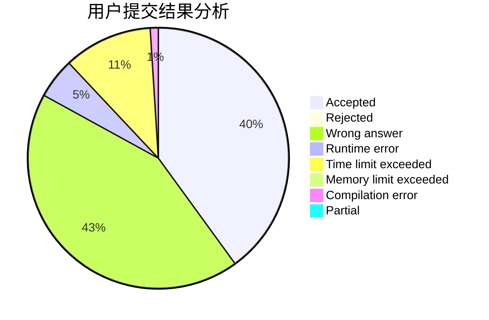
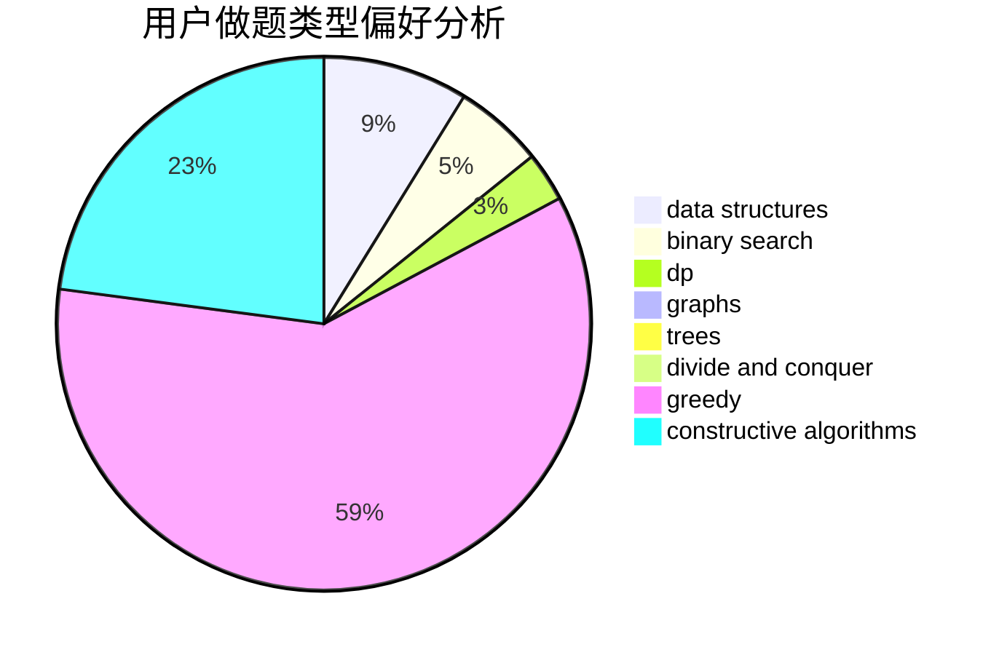
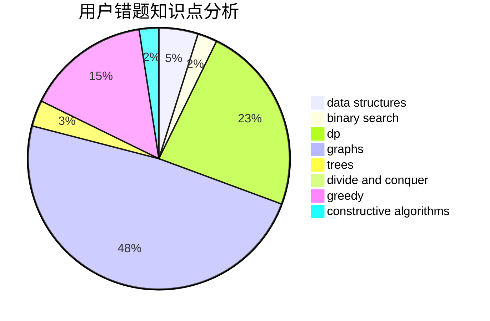

# yspm

<!-- tabs:start -->

#### **用户提交结果分析**

#### **用户做题类型偏好分析**

#### **用户错题知识点分析**

<!-- tabs:end -->
# 推荐题目
[1457D](https://codeforces.com/contest/1457/problem/D)		dsu,graphs,sortings,trees		  
[1315C](https://codeforces.com/contest/1315/problem/C)		greedy		  
[802N](https://codeforces.com/contest/802/problem/N)		binary search,
                        flows,
                        graphs		  
[818F](https://codeforces.com/contest/818/problem/F)		binary search,
                        math,
                        ternary search		  
[494A](https://codeforces.com/contest/494/problem/A)		greedy		  
[27B](https://codeforces.com/contest/27/problem/B)		bitmasks,
                        brute force,
                        dfs and similar,
                        greedy		  
[838C](https://codeforces.com/contest/838/problem/C)		dp,
                        games		  
[1184C2](https://codeforces.com/contest/1184C/problem/2)		data structures		  
[1294C](https://codeforces.com/contest/1294/problem/C)		greedy,
                        math,
                        number theory		  
[871D](https://codeforces.com/contest/871/problem/D)		dsu,graphs,sortings,trees		  
