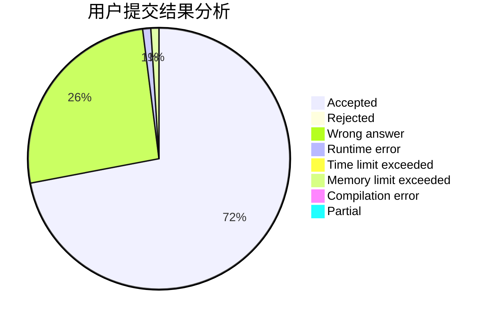
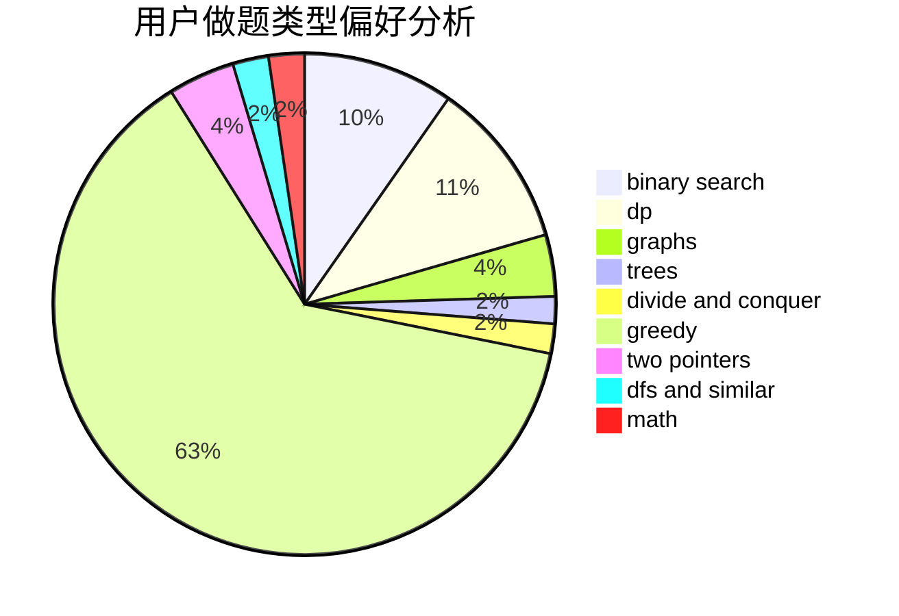

# yuanhaowei

<!-- tabs:start -->

#### **用户提交结果分析**

#### **用户做题类型偏好分析**

<!-- tabs:end -->
# 推荐题目
[185A](https://codeforces.com/contest/185/problem/A)
[1164M](https://codeforces.com/contest/1164/problem/M)
[282C](https://codeforces.com/contest/282/problem/C)
[1101A](https://codeforces.com/contest/1101/problem/A)
[190E](https://codeforces.com/contest/190/problem/E)
[639B](https://codeforces.com/contest/639/problem/B)
[236D](https://codeforces.com/contest/236/problem/D)
[1316F](https://codeforces.com/contest/1316/problem/F)
[814E](https://codeforces.com/contest/814/problem/E)
[1056F](https://codeforces.com/contest/1056/problem/F)
