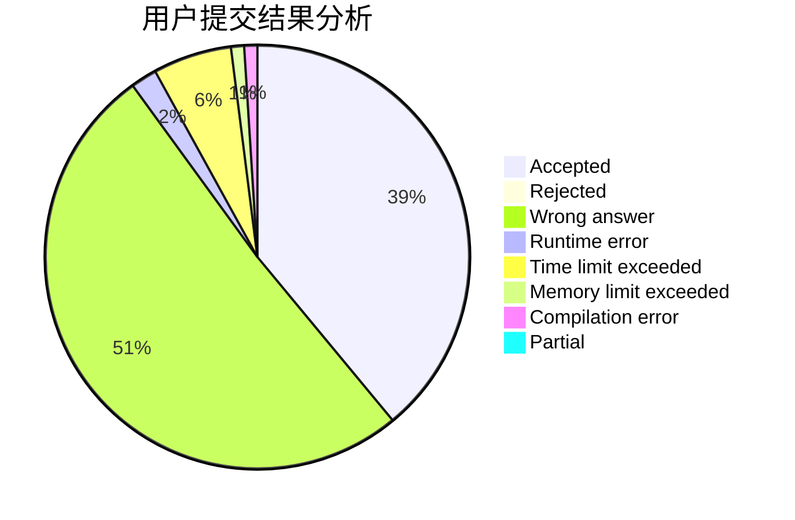
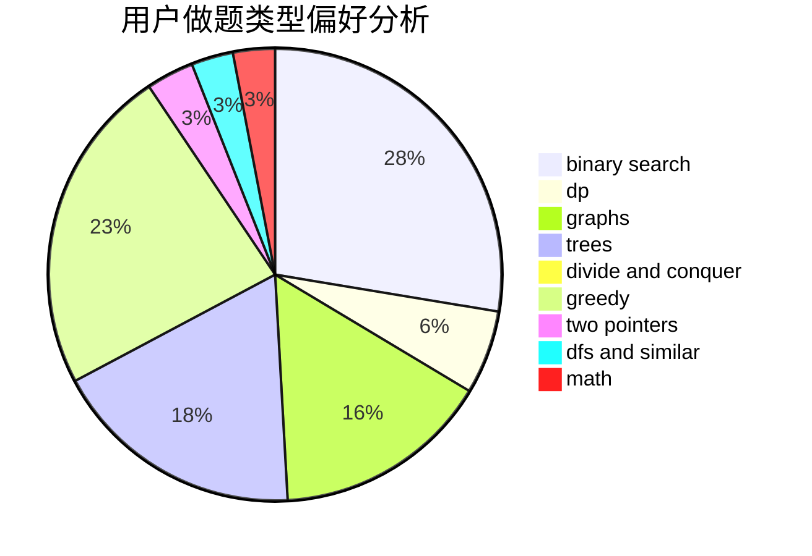

# yuanyuan1024

<!-- tabs:start -->

#### **用户提交结果分析**

#### **用户做题类型偏好分析**

<!-- tabs:end -->
# 推荐题目
[323C](https://codeforces.com/contest/323/problem/C)
[674G](https://codeforces.com/contest/674/problem/G)
[1380D](https://codeforces.com/contest/1380/problem/D)
[554A](https://codeforces.com/contest/554/problem/A)
[1075A](https://codeforces.com/contest/1075/problem/A)
[6702](https://codeforces.com/contest/670/problem/2)
[725G](https://codeforces.com/contest/725/problem/G)
[55C](https://codeforces.com/contest/55/problem/C)
[356D](https://codeforces.com/contest/356/problem/D)
[819B](https://codeforces.com/contest/819/problem/B)
