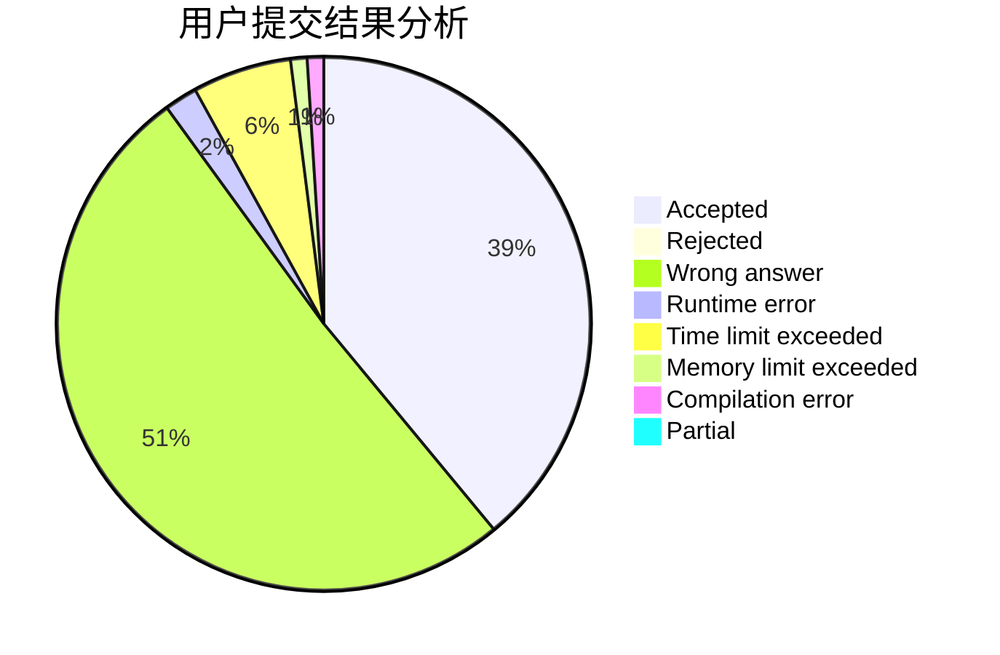
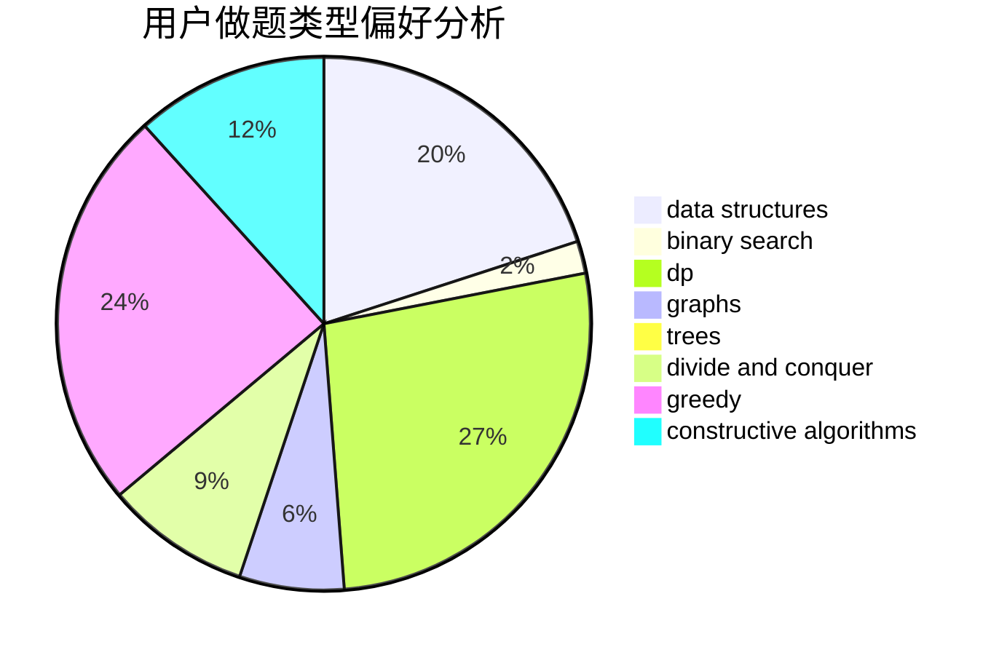
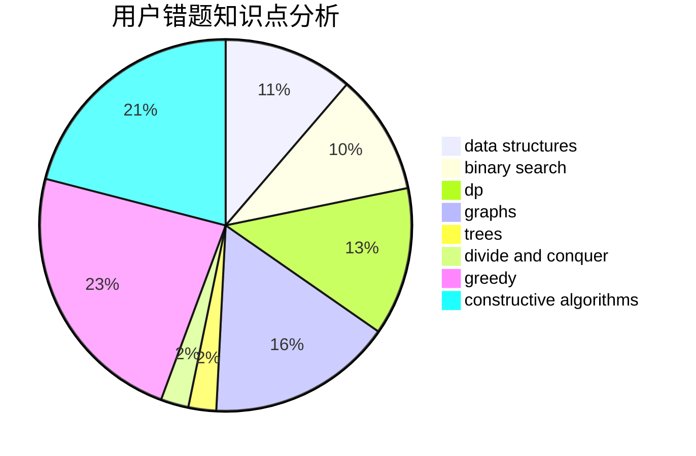

# yuanyuan1024

<!-- tabs:start -->

#### **用户提交结果分析**

#### **用户做题类型偏好分析**

#### **用户错题知识点分析**

<!-- tabs:end -->
# 推荐题目
[304B](https://codeforces.com/contest/304/problem/B)		brute force,
                        implementation		  
[650E](https://codeforces.com/contest/650/problem/E)		data structures,
                        dfs and similar,
                        dsu,
                        greedy,
                        trees		  
[1371E2](https://codeforces.com/contest/1371E/problem/2)		binary search,
                        combinatorics,
                        dp,
                        math,
                        number theory,
                        sortings		  
[533B](https://codeforces.com/contest/533/problem/B)		dfs and similar,
                        dp,
                        graphs,
                        strings,
                        trees		  
[1074A](https://codeforces.com/contest/1074/problem/A)		dsu,graphs,sortings,trees		  
[641E](https://codeforces.com/contest/641/problem/E)		data structures		  
[707E](https://codeforces.com/contest/707/problem/E)		data structures		  
[538H](https://codeforces.com/contest/538/problem/H)		2-sat,
                        data structures,
                        dfs and similar,
                        greedy		  
[328A](https://codeforces.com/contest/328/problem/A)		implementation		  
[803D](https://codeforces.com/contest/803/problem/D)		binary search,
                        greedy		  
