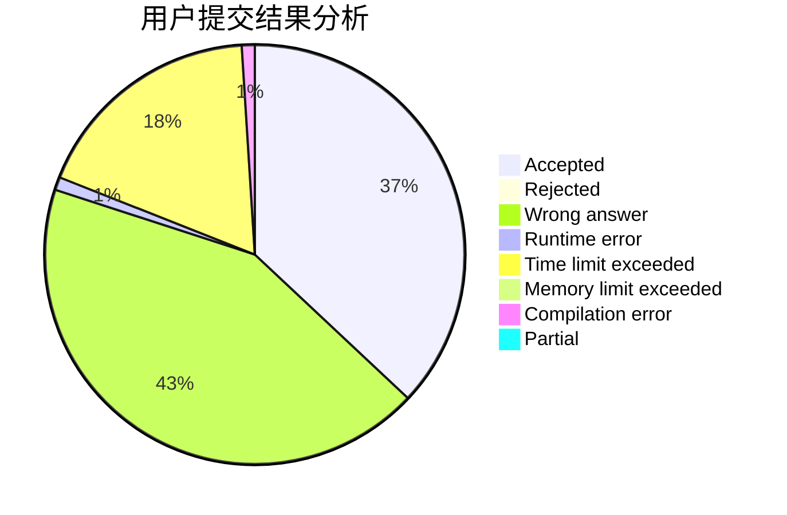
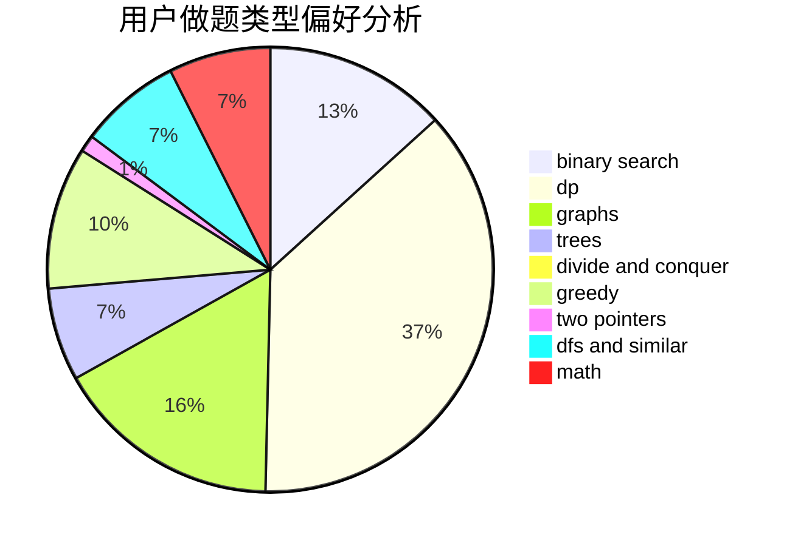

# yudanjun

<!-- tabs:start -->

#### **用户提交结果分析**

#### **用户做题类型偏好分析**

<!-- tabs:end -->
# 推荐题目
[1513C](https://codeforces.com/contest/1513/problem/C)
[720C](https://codeforces.com/contest/720/problem/C)
[607E](https://codeforces.com/contest/607/problem/E)
[516C](https://codeforces.com/contest/516/problem/C)
[468E](https://codeforces.com/contest/468/problem/E)
[632C](https://codeforces.com/contest/632/problem/C)
[725B](https://codeforces.com/contest/725/problem/B)
[349B](https://codeforces.com/contest/349/problem/B)
[176B](https://codeforces.com/contest/176/problem/B)
[710C](https://codeforces.com/contest/710/problem/C)
