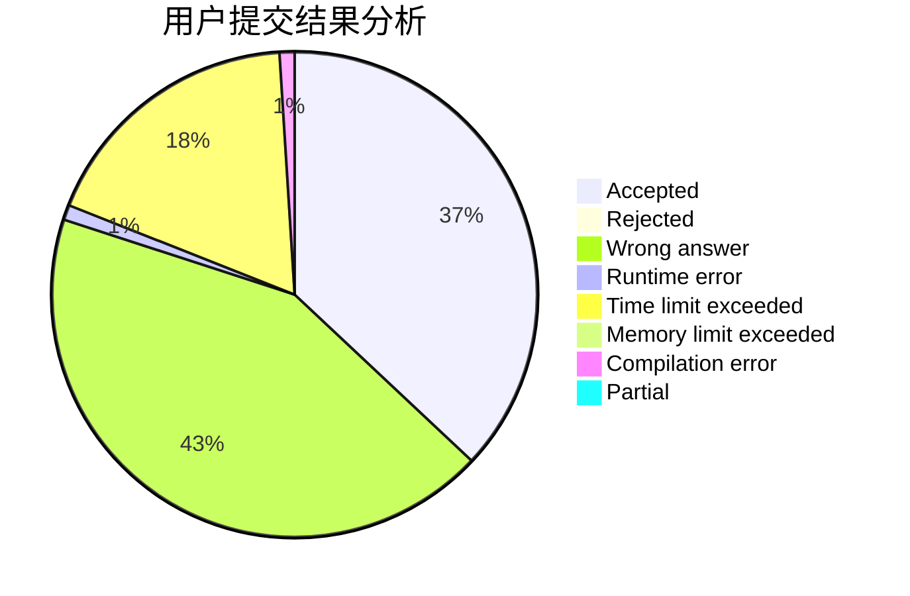
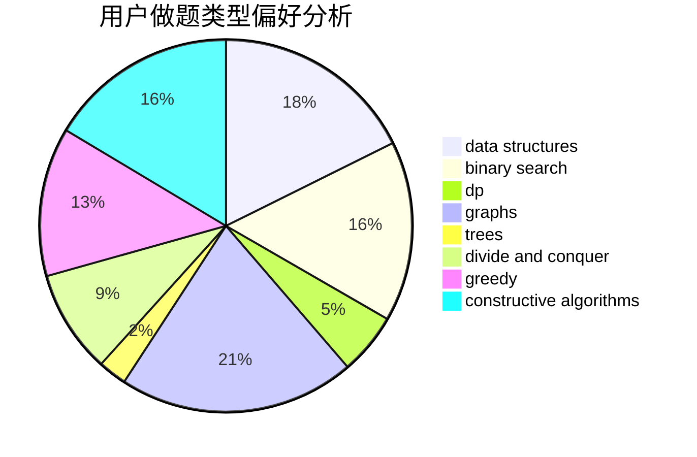

# yudanjun

<!-- tabs:start -->

#### **用户提交结果分析**

#### **用户做题类型偏好分析**

#### **用户错题知识点分析**

<!-- tabs:end -->
# 推荐题目
[1504D](https://codeforces.com/contest/1504/problem/D)		dsu,graphs,sortings,trees		  
[701F](https://codeforces.com/contest/701/problem/F)		dsu,graphs,sortings,trees		  
[587D](https://codeforces.com/contest/587/problem/D)		2-sat,
                        binary search		  
[497B](https://codeforces.com/contest/497/problem/B)		dsu,graphs,sortings,trees		  
[449B](https://codeforces.com/contest/449/problem/B)		graphs,
                        greedy,
                        shortest paths		  
[612F](https://codeforces.com/contest/612/problem/F)		dp		  
[706E](https://codeforces.com/contest/706/problem/E)		data structures,
                        implementation		  
[319A](https://codeforces.com/contest/319/problem/A)		combinatorics,
                        math		  
[154C](https://codeforces.com/contest/154/problem/C)		graphs,
                        hashing,
                        sortings		  
[690A2](https://codeforces.com/contest/690A/problem/2)		nan		  
