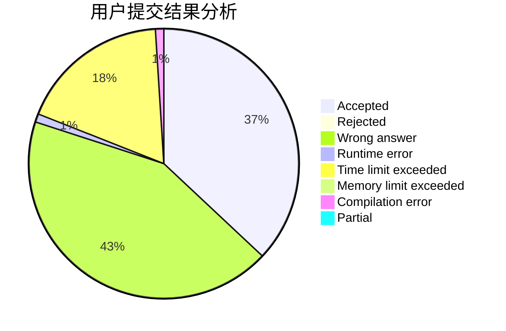
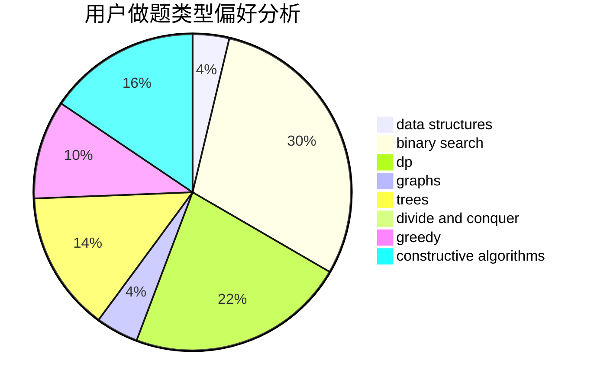

# yudanjun

<!-- tabs:start -->

#### **用户提交结果分析**

#### **用户做题类型偏好分析**

#### **用户错题知识点分析**

<!-- tabs:end -->
# 推荐题目
[1513C](https://codeforces.com/contest/1513/problem/C)		dp,
                        matrices		  
[720C](https://codeforces.com/contest/720/problem/C)		constructive algorithms		  
[607E](https://codeforces.com/contest/607/problem/E)		binary search,
                        geometry		  
[516C](https://codeforces.com/contest/516/problem/C)		dsu,graphs,sortings,trees		  
[468E](https://codeforces.com/contest/468/problem/E)		dp,
                        graph matchings,
                        math,
                        meet-in-the-middle		  
[632C](https://codeforces.com/contest/632/problem/C)		sortings,
                        strings		  
[725B](https://codeforces.com/contest/725/problem/B)		implementation,
                        math		  
[349B](https://codeforces.com/contest/349/problem/B)		data structures,
                        dp,
                        greedy,
                        implementation		  
[176B](https://codeforces.com/contest/176/problem/B)		dp		  
[710C](https://codeforces.com/contest/710/problem/C)		constructive algorithms,
                        math		  
