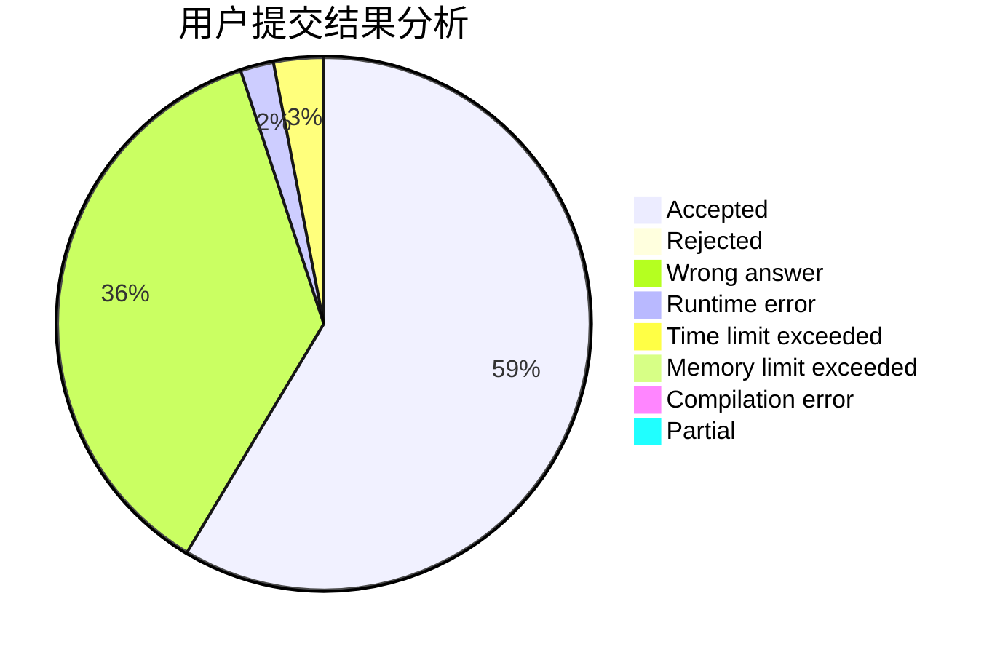
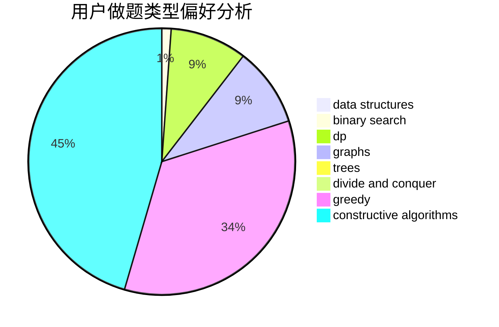
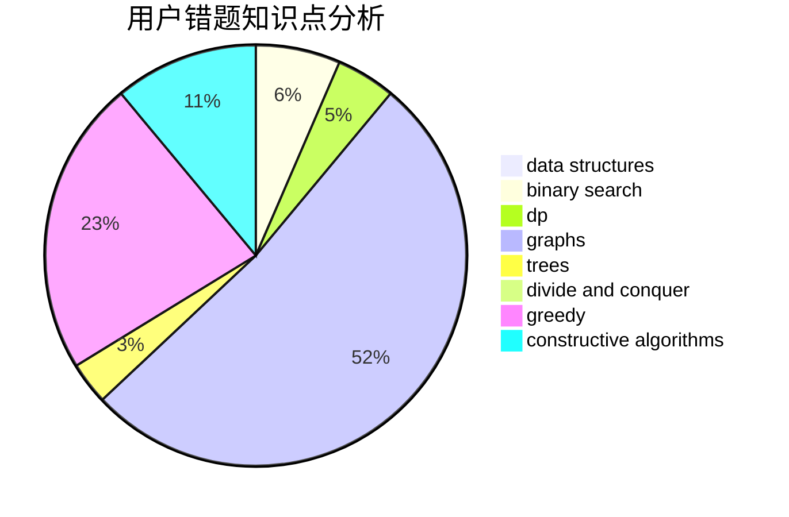

# yudashen

<!-- tabs:start -->

#### **用户提交结果分析**

#### **用户做题类型偏好分析**

#### **用户错题知识点分析**

<!-- tabs:end -->
# 推荐题目
[165E](https://codeforces.com/contest/165/problem/E)		bitmasks,
                        brute force,
                        dfs and similar,
                        dp		  
[656F](https://codeforces.com/contest/656/problem/F)		*special problem		  
[1063C](https://codeforces.com/contest/1063/problem/C)		binary search,
                        constructive algorithms,
                        geometry,
                        interactive		  
[97E](https://codeforces.com/contest/97/problem/E)		dfs and similar,
                        dsu,
                        graphs,
                        trees		  
[1071A](https://codeforces.com/contest/1071/problem/A)		dsu,graphs,sortings,trees		  
[873D](https://codeforces.com/contest/873/problem/D)		constructive algorithms,
                        divide and conquer		  
[120H](https://codeforces.com/contest/120/problem/H)		graph matchings		  
[369B](https://codeforces.com/contest/369/problem/B)		constructive algorithms,
                        implementation,
                        math		  
[1113C](https://codeforces.com/contest/1113/problem/C)		dsu,graphs,sortings,trees		  
[855C](https://codeforces.com/contest/855/problem/C)		dp,
                        trees		  
