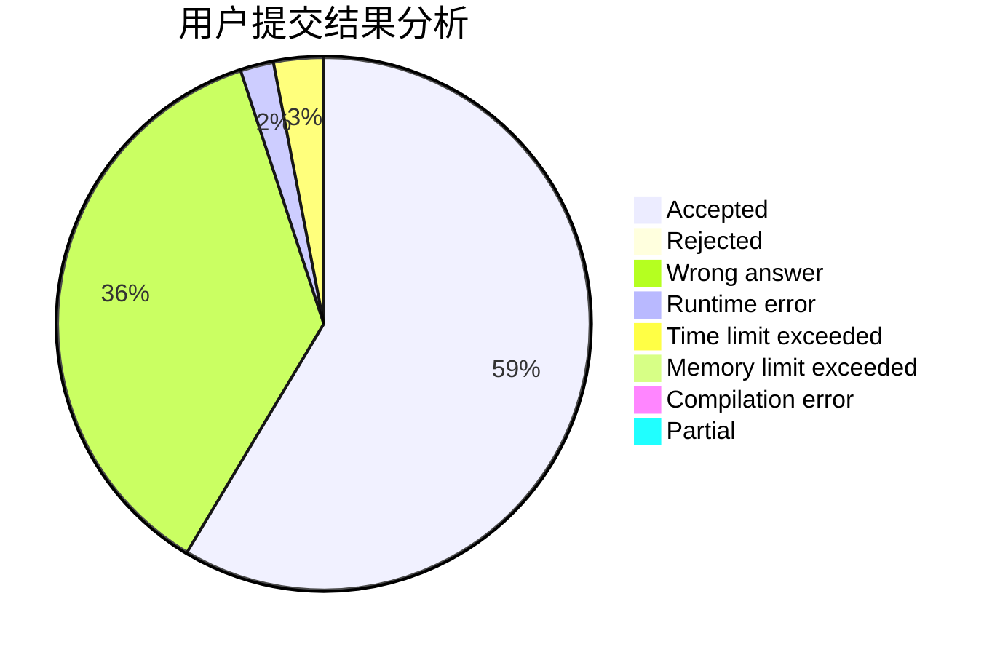
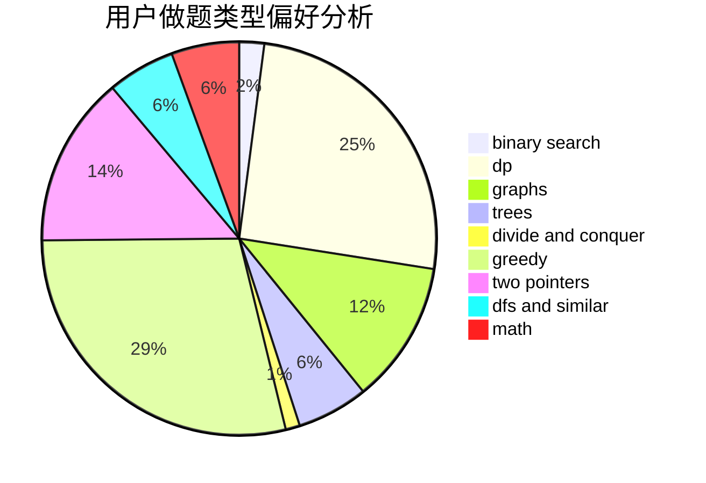

# yudashen

<!-- tabs:start -->

#### **用户提交结果分析**

#### **用户做题类型偏好分析**

<!-- tabs:end -->
# 推荐题目
[190E](https://codeforces.com/contest/190/problem/E)
[678F](https://codeforces.com/contest/678/problem/F)
[1063F](https://codeforces.com/contest/1063/problem/F)
[995B](https://codeforces.com/contest/995/problem/B)
[1071D](https://codeforces.com/contest/1071/problem/D)
[894C](https://codeforces.com/contest/894/problem/C)
[12162](https://codeforces.com/contest/1216/problem/2)
[39D](https://codeforces.com/contest/39/problem/D)
[1114A](https://codeforces.com/contest/1114/problem/A)
[873D](https://codeforces.com/contest/873/problem/D)
