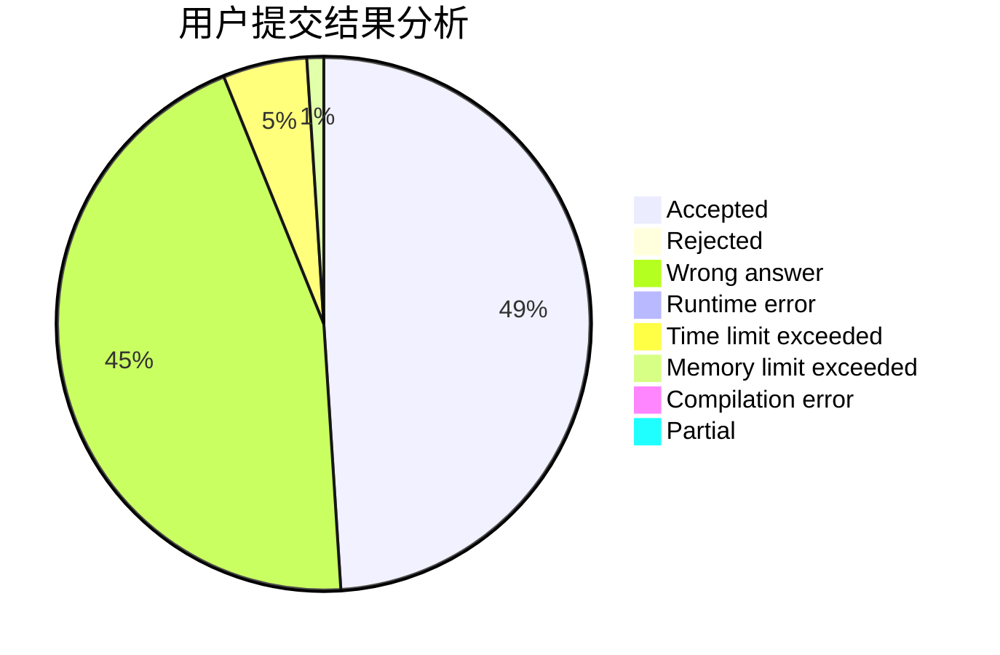
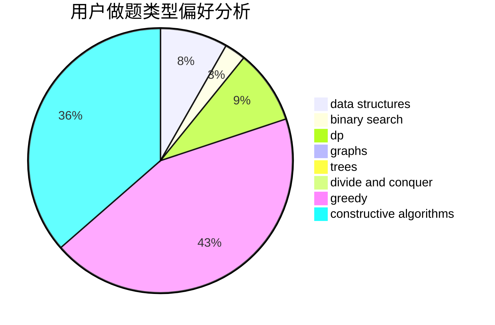
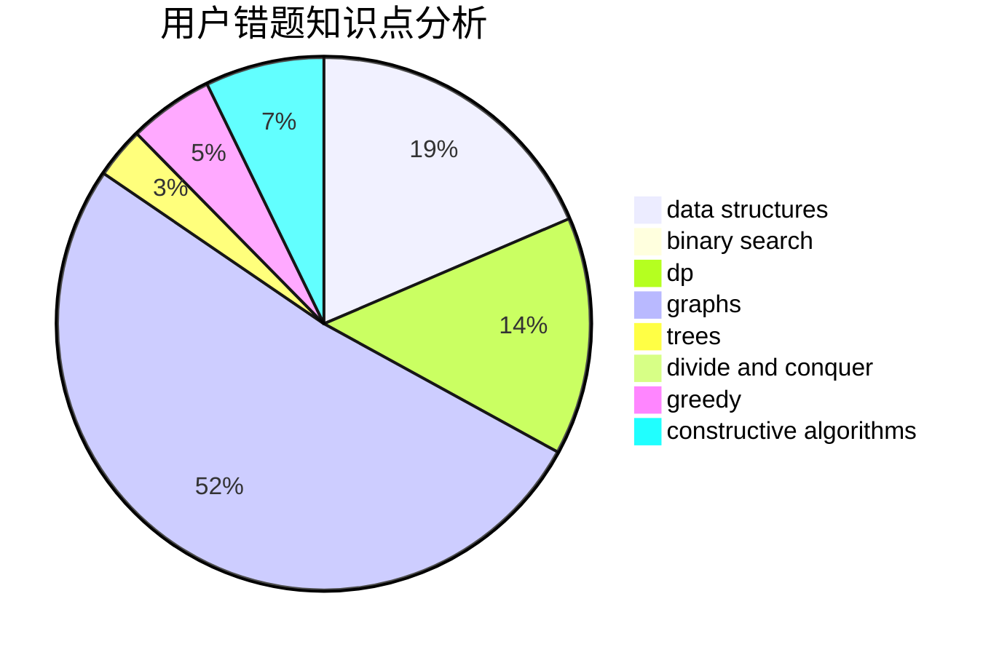

# yukihana0416

<!-- tabs:start -->

#### **用户提交结果分析**

#### **用户做题类型偏好分析**

#### **用户错题知识点分析**

<!-- tabs:end -->
# 推荐题目
[1141D](https://codeforces.com/contest/1141/problem/D)		greedy,
                        implementation		  
[759D](https://codeforces.com/contest/759/problem/D)		dsu,graphs,sortings,trees		  
[176B](https://codeforces.com/contest/176/problem/B)		dp		  
[1017G](https://codeforces.com/contest/1017/problem/G)		data structures		  
[628C](https://codeforces.com/contest/628/problem/C)		greedy,
                        strings		  
[238A](https://codeforces.com/contest/238/problem/A)		constructive algorithms,
                        math		  
[1101C](https://codeforces.com/contest/1101/problem/C)		sortings		  
[940D](https://codeforces.com/contest/940/problem/D)		binary search,
                        implementation		  
[256D](https://codeforces.com/contest/256/problem/D)		dp		  
[1066B](https://codeforces.com/contest/1066/problem/B)		greedy,
                        two pointers		  
