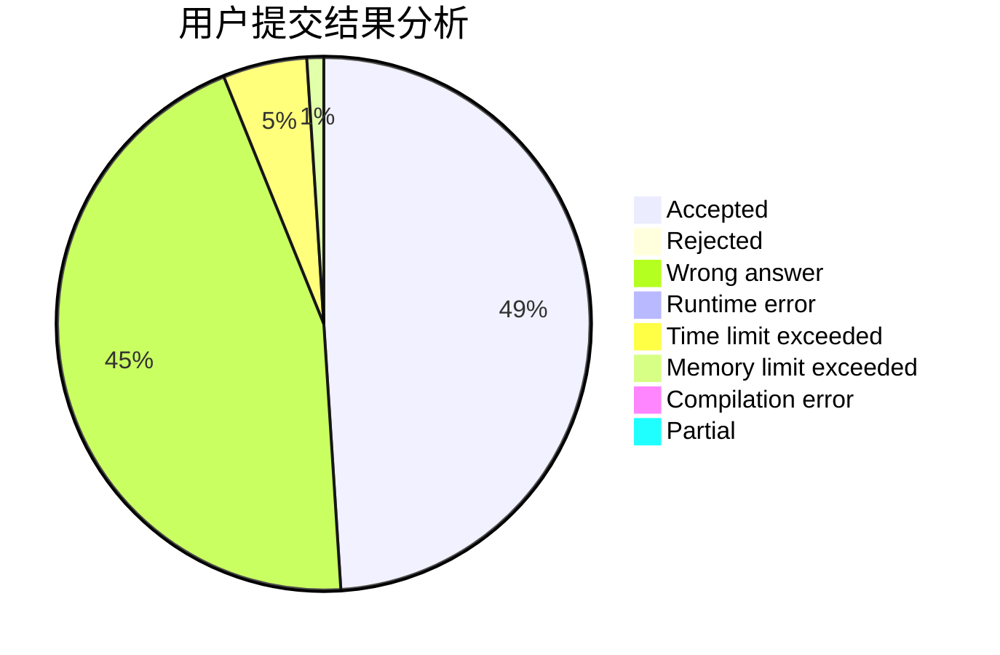
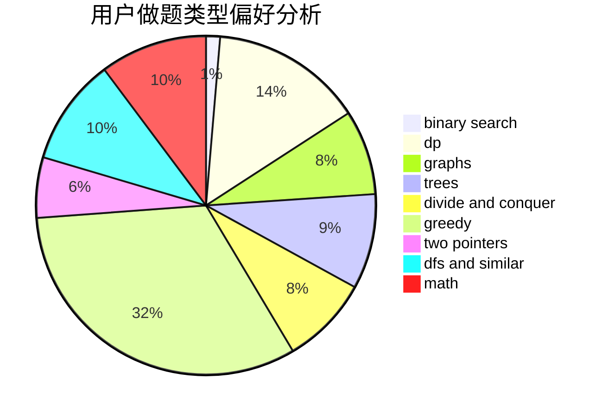

# yukihana0416

<!-- tabs:start -->

#### **用户提交结果分析**

#### **用户做题类型偏好分析**

<!-- tabs:end -->
# 推荐题目
[1141D](https://codeforces.com/contest/1141/problem/D)
[759D](https://codeforces.com/contest/759/problem/D)
[176B](https://codeforces.com/contest/176/problem/B)
[1017G](https://codeforces.com/contest/1017/problem/G)
[628C](https://codeforces.com/contest/628/problem/C)
[238A](https://codeforces.com/contest/238/problem/A)
[1101C](https://codeforces.com/contest/1101/problem/C)
[940D](https://codeforces.com/contest/940/problem/D)
[256D](https://codeforces.com/contest/256/problem/D)
[1066B](https://codeforces.com/contest/1066/problem/B)
