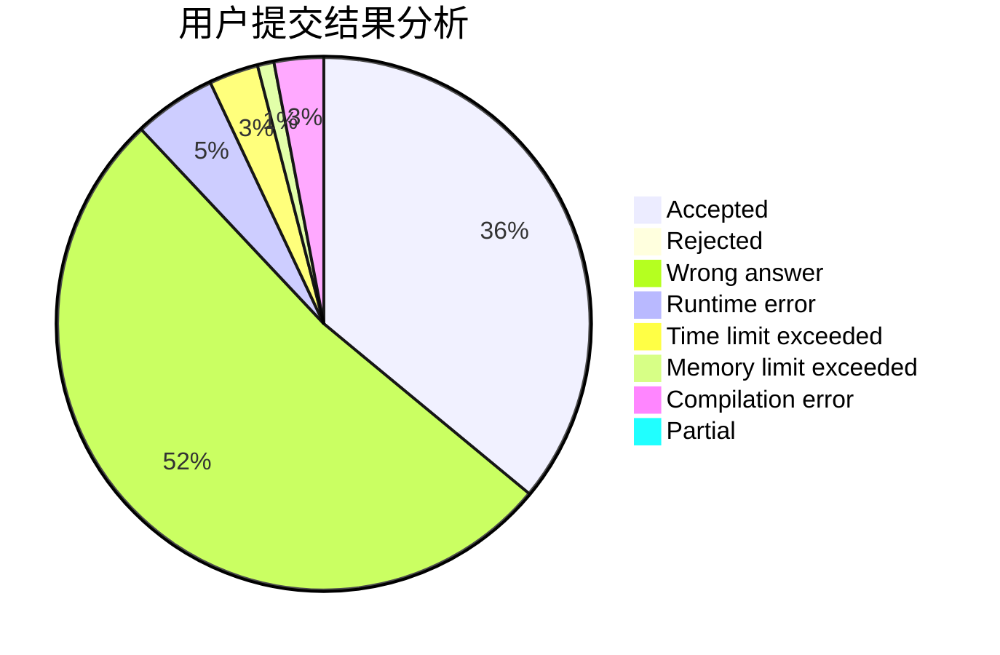
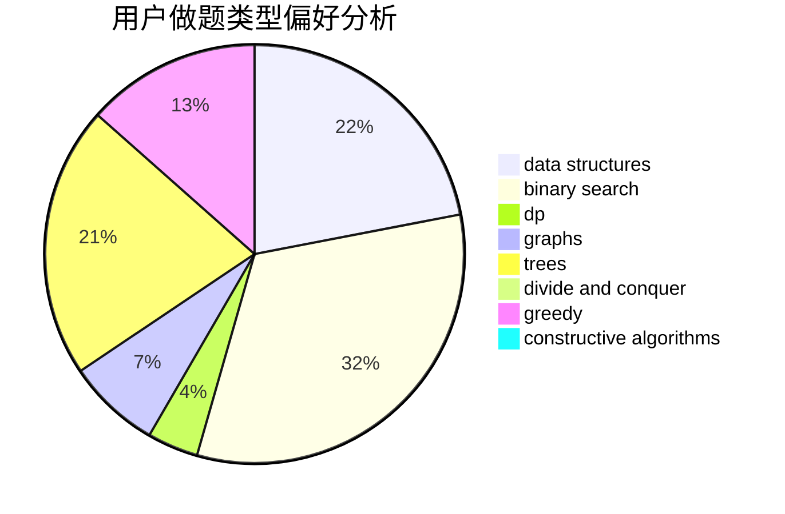
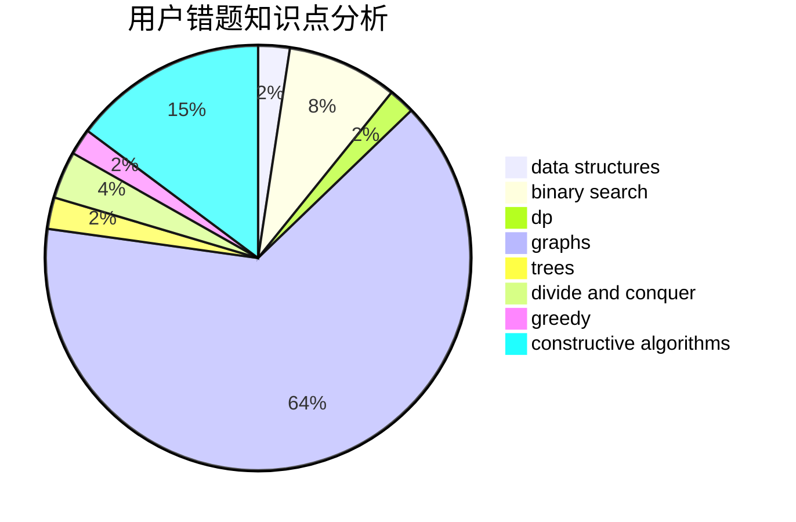

# yukosa_QAQ

<!-- tabs:start -->

#### **用户提交结果分析**

#### **用户做题类型偏好分析**

#### **用户错题知识点分析**

<!-- tabs:end -->
# 推荐题目
[635A](https://codeforces.com/contest/635/problem/A)		brute force,
                        implementation		  
[571C](https://codeforces.com/contest/571/problem/C)		constructive algorithms,
                        dfs and similar,
                        graphs,
                        greedy		  
[803E](https://codeforces.com/contest/803/problem/E)		dp,
                        graphs		  
[1505F](https://codeforces.com/contest/1505/problem/F)		math		  
[15A](https://codeforces.com/contest/15/problem/A)		implementation,
                        sortings		  
[635E](https://codeforces.com/contest/635/problem/E)		dsu,graphs,sortings,trees		  
[739B](https://codeforces.com/contest/739/problem/B)		binary search,
                        data structures,
                        dfs and similar,
                        graphs,
                        trees		  
[303A](https://codeforces.com/contest/303/problem/A)		constructive algorithms,
                        implementation,
                        math		  
[956C](https://codeforces.com/contest/956/problem/C)		dsu,graphs,sortings,trees		  
[1366G](https://codeforces.com/contest/1366/problem/G)		data structures,
                        dp,
                        strings		  
