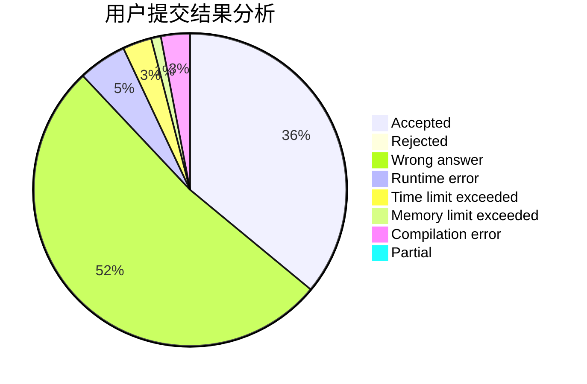
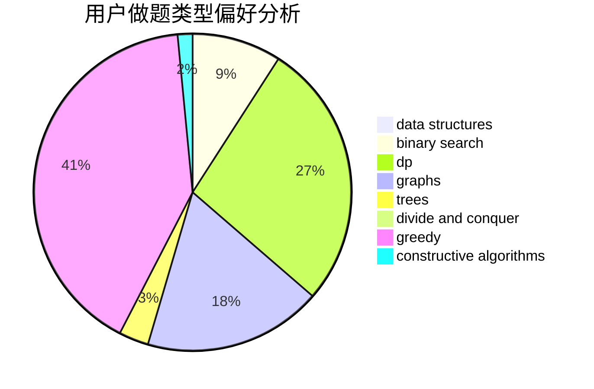
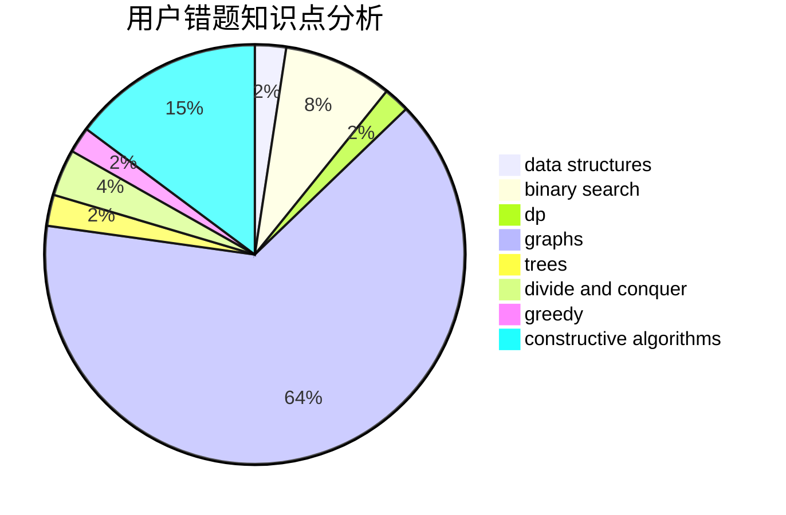

# yukosa_QAQ

<!-- tabs:start -->

#### **用户提交结果分析**

#### **用户做题类型偏好分析**

#### **用户错题知识点分析**

<!-- tabs:end -->
# 推荐题目
[667C](https://codeforces.com/contest/667/problem/C)		dsu,graphs,sortings,trees		  
[591D](https://codeforces.com/contest/591/problem/D)		dsu,graphs,sortings,trees		  
[819D](https://codeforces.com/contest/819/problem/D)		number theory		  
[155A](https://codeforces.com/contest/155/problem/A)		brute force		  
[181B](https://codeforces.com/contest/181/problem/B)		binary search,
                        brute force		  
[667E](https://codeforces.com/contest/667/problem/E)		dsu,graphs,sortings,trees		  
[75A](https://codeforces.com/contest/75/problem/A)		implementation		  
[321B](https://codeforces.com/contest/321/problem/B)		dp,
                        flows,
                        greedy		  
[978A](https://codeforces.com/contest/978/problem/A)		implementation		  
[1373F](https://codeforces.com/contest/1373/problem/F)		binary search,
                        constructive algorithms,
                        data structures,
                        greedy		  
