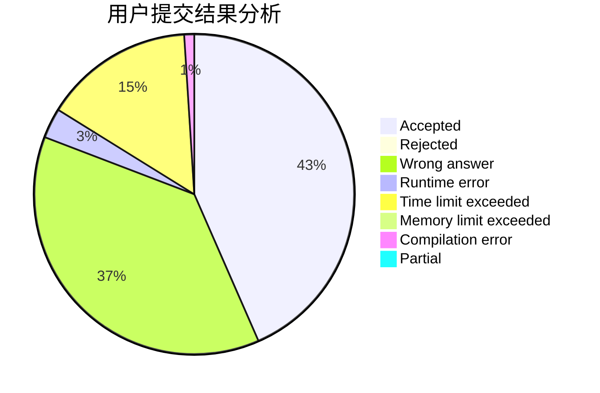
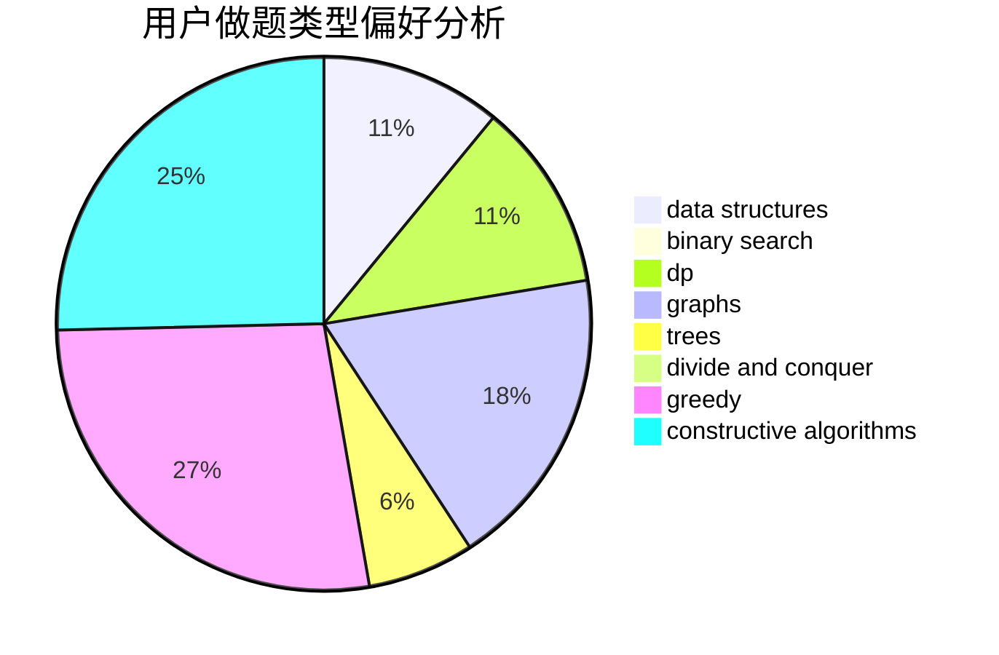
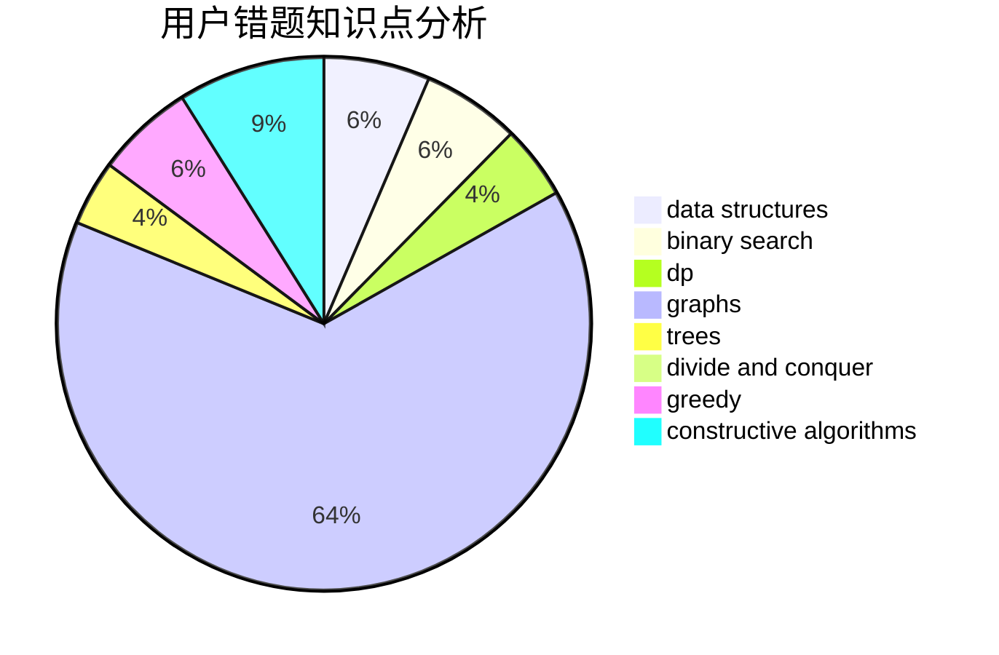

# Chasingdreams

<!-- tabs:start -->

#### **用户提交结果分析**

#### **用户做题类型偏好分析**

#### **用户错题知识点分析**

<!-- tabs:end -->
# 推荐题目
[1422A](https://codeforces.com/contest/1422/problem/A)		geometry,
                        math		  
[1468J](https://codeforces.com/contest/1468/problem/J)		dsu,
                        graphs,
                        greedy		  
[447A](https://codeforces.com/contest/447/problem/A)		implementation		  
[446E](https://codeforces.com/contest/446/problem/E)		math,
                        matrices		  
[446D](https://codeforces.com/contest/446/problem/D)		math,
                        matrices,
                        probabilities		  
[448D](https://codeforces.com/contest/448/problem/D)		binary search,
                        brute force		  
[3D](https://codeforces.com/contest/3/problem/D)		greedy		  
[141B](https://codeforces.com/contest/141/problem/B)		geometry,
                        math		  
[232E](https://codeforces.com/contest/232/problem/E)		bitmasks,
                        divide and conquer,
                        dp		  
[245A](https://codeforces.com/contest/245/problem/A)		implementation		  
