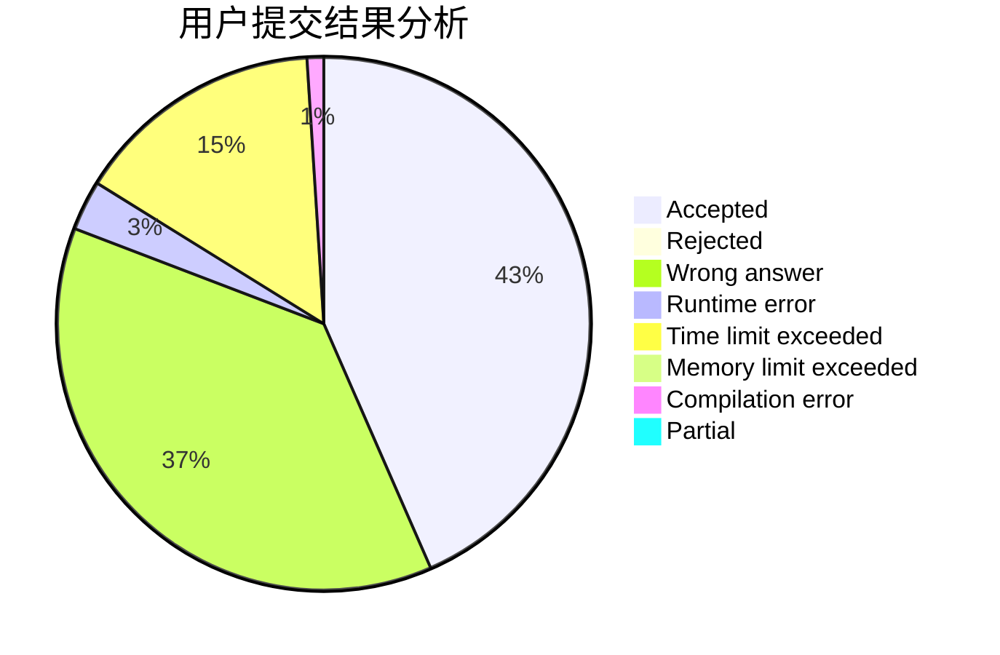
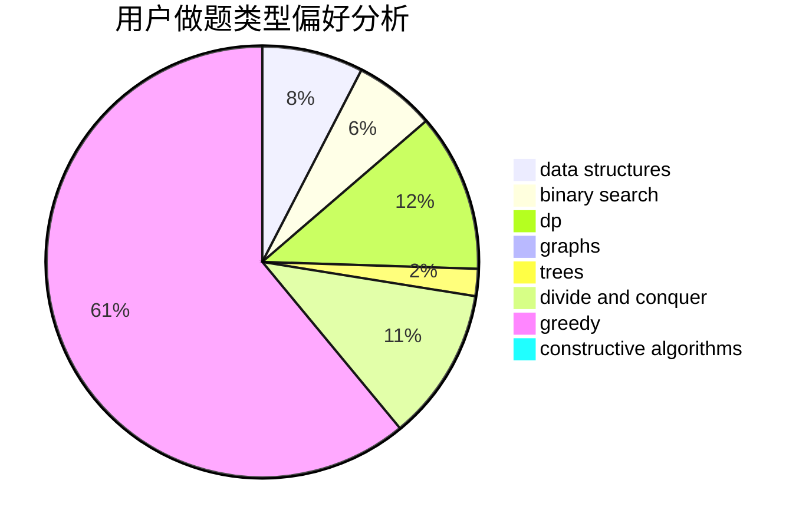
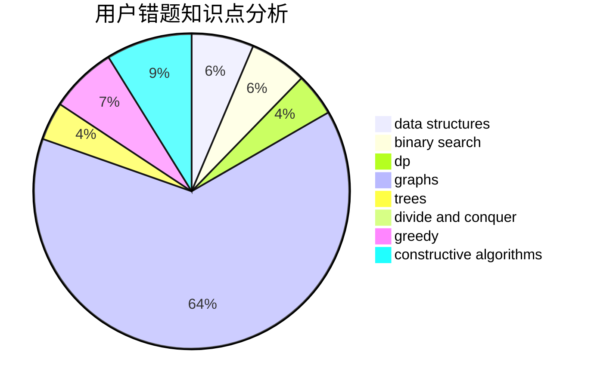

# Chasingdreams

<!-- tabs:start -->

#### **用户提交结果分析**

#### **用户做题类型偏好分析**

#### **用户错题知识点分析**

<!-- tabs:end -->
# 推荐题目
[1411F](https://codeforces.com/contest/1411/problem/F)		greedy,
                        math		  
[1460A](https://codeforces.com/contest/1460/problem/A)		dsu,graphs,sortings,trees		  
[424B](https://codeforces.com/contest/424/problem/B)		binary search,
                        greedy,
                        implementation,
                        sortings		  
[424A](https://codeforces.com/contest/424/problem/A)		implementation		  
[421B](https://codeforces.com/contest/421/problem/B)		dsu,graphs,sortings,trees		  
[425B](https://codeforces.com/contest/425/problem/B)		bitmasks,
                        greedy		  
[370B](https://codeforces.com/contest/370/problem/B)		implementation		  
[1409C](https://codeforces.com/contest/1409/problem/C)		brute force,
                        math,
                        number theory		  
[213C](https://codeforces.com/contest/213/problem/C)		dp		  
[226B](https://codeforces.com/contest/226/problem/B)		greedy		  
