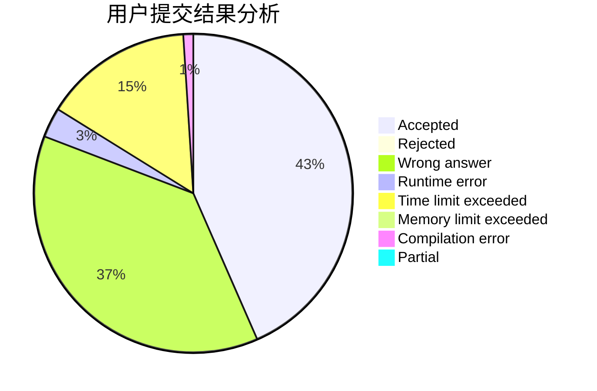
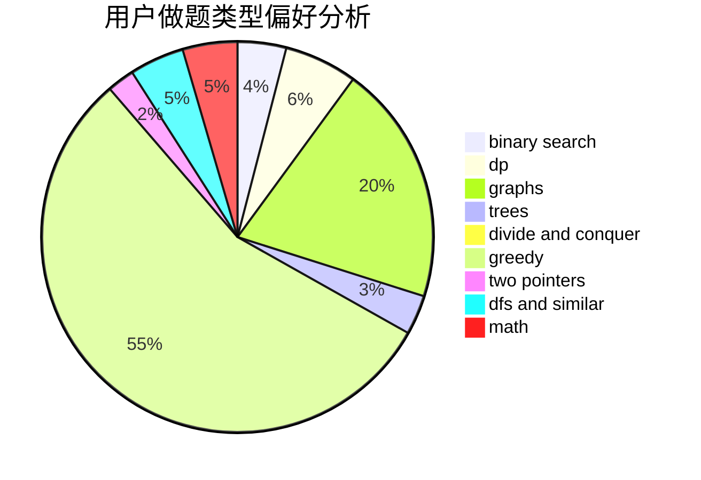

# Chasingdreams

<!-- tabs:start -->

#### **用户提交结果分析**

#### **用户做题类型偏好分析**

<!-- tabs:end -->
# 推荐题目
[1422A](https://codeforces.com/contest/1422/problem/A)
[1468J](https://codeforces.com/contest/1468/problem/J)
[447A](https://codeforces.com/contest/447/problem/A)
[446E](https://codeforces.com/contest/446/problem/E)
[446D](https://codeforces.com/contest/446/problem/D)
[448D](https://codeforces.com/contest/448/problem/D)
[3D](https://codeforces.com/contest/3/problem/D)
[141B](https://codeforces.com/contest/141/problem/B)
[232E](https://codeforces.com/contest/232/problem/E)
[245A](https://codeforces.com/contest/245/problem/A)
