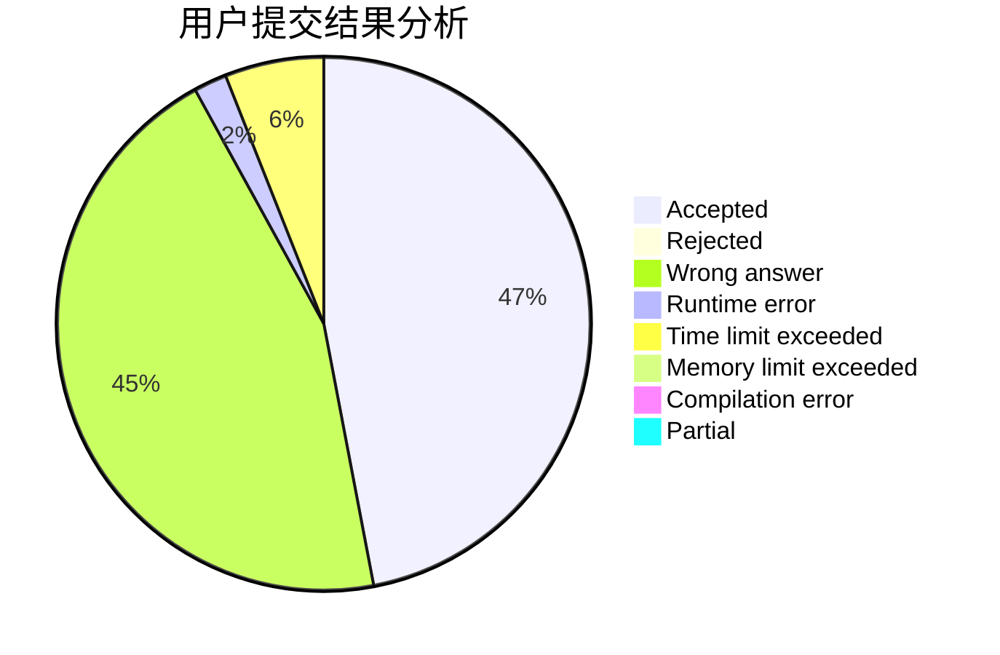
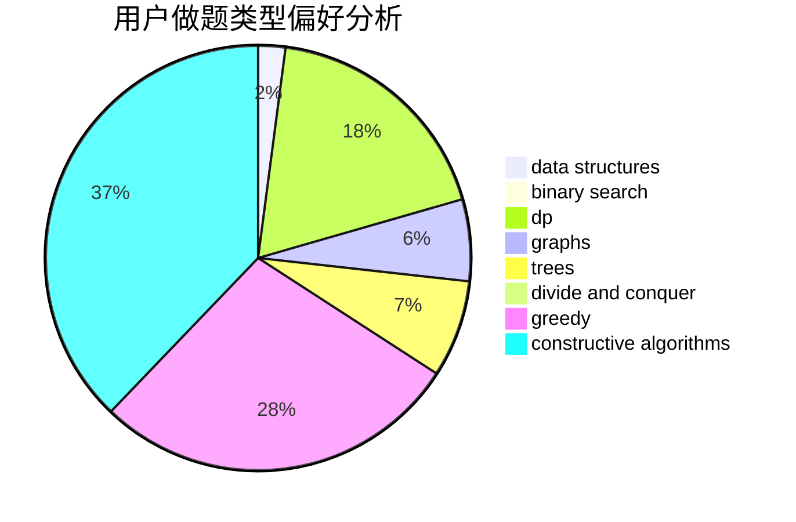
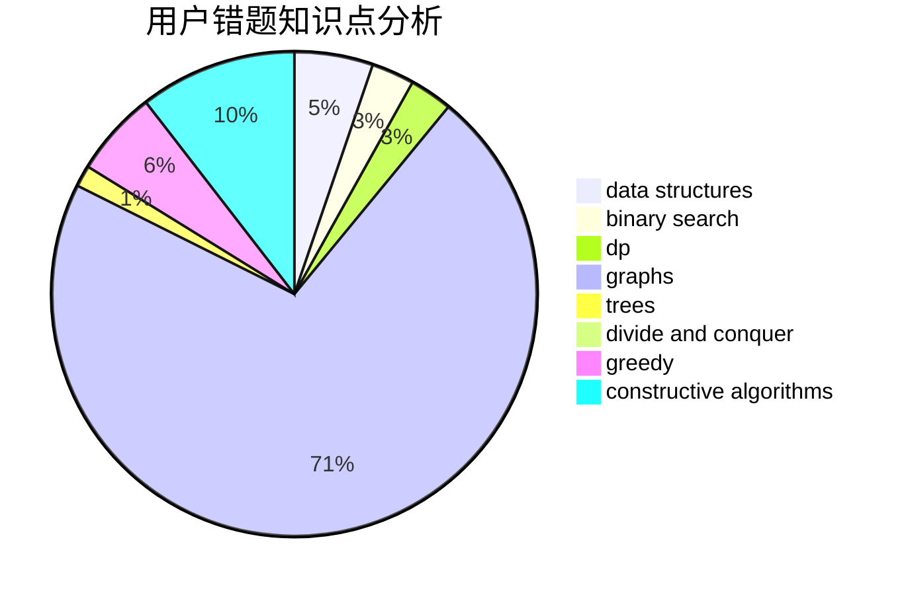

# yuruiyin

<!-- tabs:start -->

#### **用户提交结果分析**

#### **用户做题类型偏好分析**

#### **用户错题知识点分析**

<!-- tabs:end -->
# 推荐题目
[1490D](https://codeforces.com/contest/1490/problem/D)		dfs and similar,
                        divide and conquer,
                        implementation		  
[754C](https://codeforces.com/contest/754/problem/C)		brute force,
                        constructive algorithms,
                        dp,
                        implementation,
                        strings		  
[274C](https://codeforces.com/contest/274/problem/C)		brute force,
                        geometry		  
[792B](https://codeforces.com/contest/792/problem/B)		implementation		  
[1246A](https://codeforces.com/contest/1246/problem/A)		dsu,graphs,sortings,trees		  
[707D](https://codeforces.com/contest/707/problem/D)		bitmasks,
                        data structures,
                        dfs and similar,
                        implementation		  
[1103E](https://codeforces.com/contest/1103/problem/E)		fft,
                        math,
                        number theory		  
[20A](https://codeforces.com/contest/20/problem/A)		implementation		  
[1384A](https://codeforces.com/contest/1384/problem/A)		constructive algorithms,
                        greedy,
                        strings		  
[699C](https://codeforces.com/contest/699/problem/C)		dsu,graphs,sortings,trees		  
