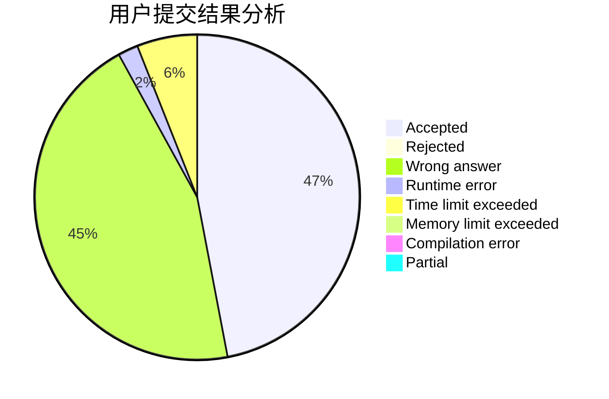
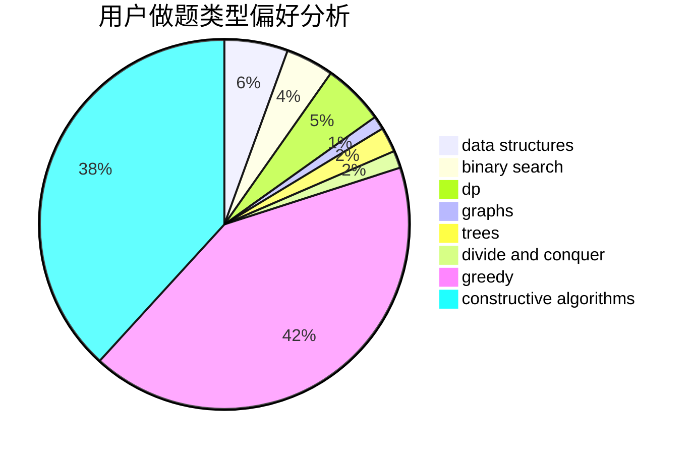
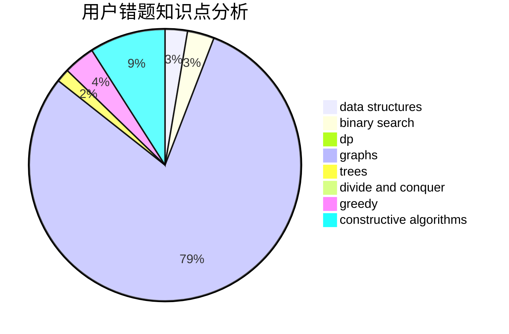

# yuruiyin

<!-- tabs:start -->

#### **用户提交结果分析**

#### **用户做题类型偏好分析**

#### **用户错题知识点分析**

<!-- tabs:end -->
# 推荐题目
[1499C](https://codeforces.com/contest/1499/problem/C)		brute force,
                        data structures,
                        greedy,
                        math		  
[772D](https://codeforces.com/contest/772/problem/D)		bitmasks,
                        dp		  
[28B](https://codeforces.com/contest/28/problem/B)		dfs and similar,
                        dsu,
                        graphs		  
[808A](https://codeforces.com/contest/808/problem/A)		implementation		  
[1250I](https://codeforces.com/contest/1250/problem/I)		binary search,
                        brute force,
                        greedy,
                        shortest paths		  
[725F](https://codeforces.com/contest/725/problem/F)		games,
                        greedy		  
[1104C](https://codeforces.com/contest/1104/problem/C)		dsu,graphs,sortings,trees		  
[231C](https://codeforces.com/contest/231/problem/C)		binary search,
                        sortings,
                        two pointers		  
[1393D](https://codeforces.com/contest/1393/problem/D)		dfs and similar,
                        dp,
                        implementation,
                        shortest paths		  
[716B](https://codeforces.com/contest/716/problem/B)		greedy,
                        two pointers		  
