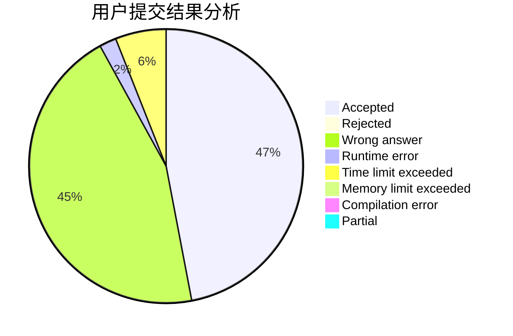
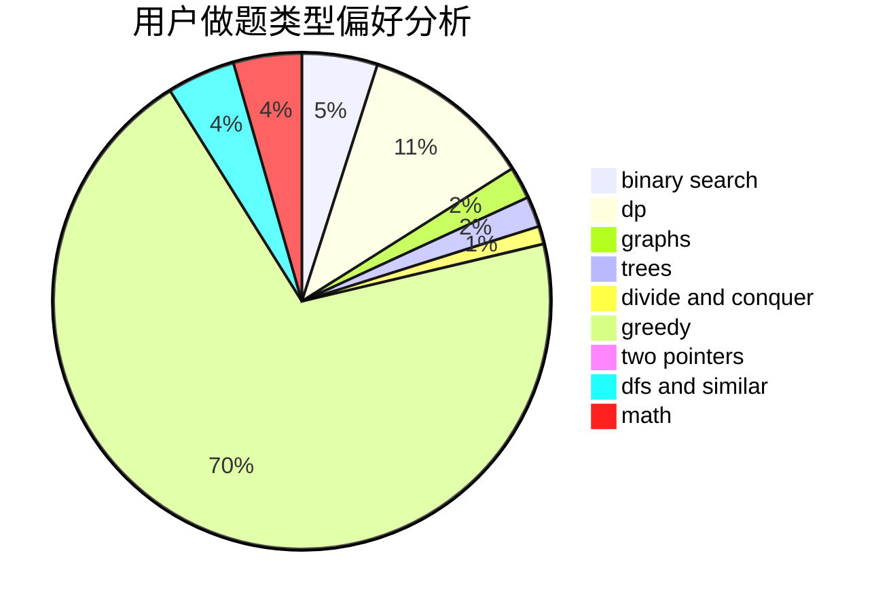

# yuruiyin

<!-- tabs:start -->

#### **用户提交结果分析**

#### **用户做题类型偏好分析**

<!-- tabs:end -->
# 推荐题目
[1499C](https://codeforces.com/contest/1499/problem/C)
[772D](https://codeforces.com/contest/772/problem/D)
[28B](https://codeforces.com/contest/28/problem/B)
[808A](https://codeforces.com/contest/808/problem/A)
[1250I](https://codeforces.com/contest/1250/problem/I)
[725F](https://codeforces.com/contest/725/problem/F)
[1104C](https://codeforces.com/contest/1104/problem/C)
[231C](https://codeforces.com/contest/231/problem/C)
[1393D](https://codeforces.com/contest/1393/problem/D)
[716B](https://codeforces.com/contest/716/problem/B)
