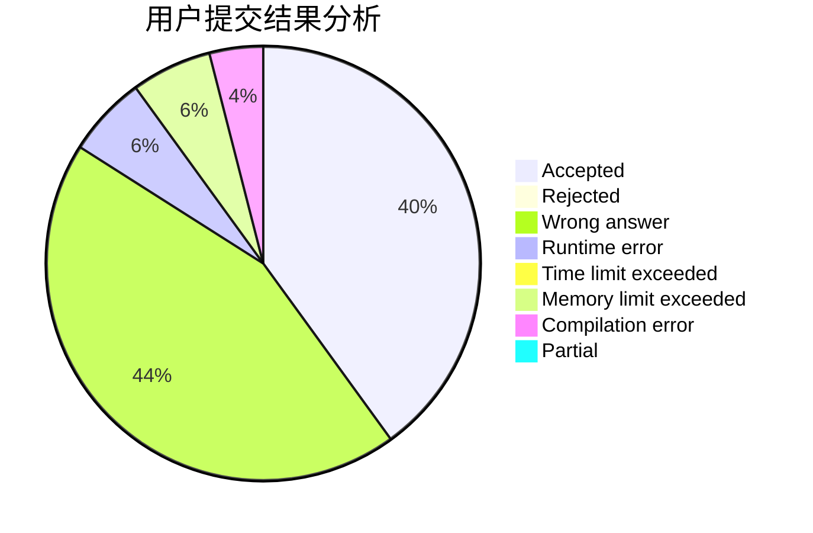
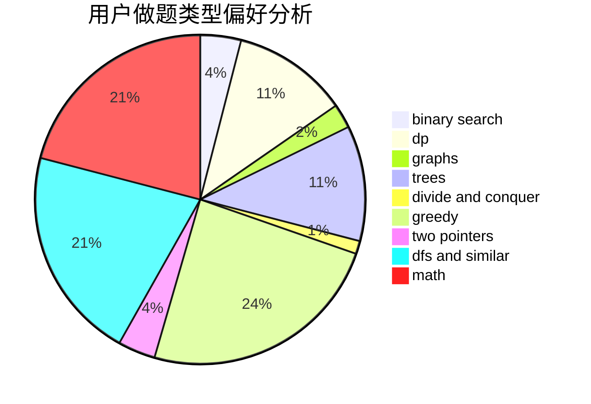

# yuwenkuo

<!-- tabs:start -->

#### **用户提交结果分析**

#### **用户做题类型偏好分析**

<!-- tabs:end -->
# 推荐题目
[220C](https://codeforces.com/contest/220/problem/C)
[793G](https://codeforces.com/contest/793/problem/G)
[44E](https://codeforces.com/contest/44/problem/E)
[630G](https://codeforces.com/contest/630/problem/G)
[216D](https://codeforces.com/contest/216/problem/D)
[93A](https://codeforces.com/contest/93/problem/A)
[1008E](https://codeforces.com/contest/1008/problem/E)
[960C](https://codeforces.com/contest/960/problem/C)
[672D](https://codeforces.com/contest/672/problem/D)
[124A](https://codeforces.com/contest/124/problem/A)
