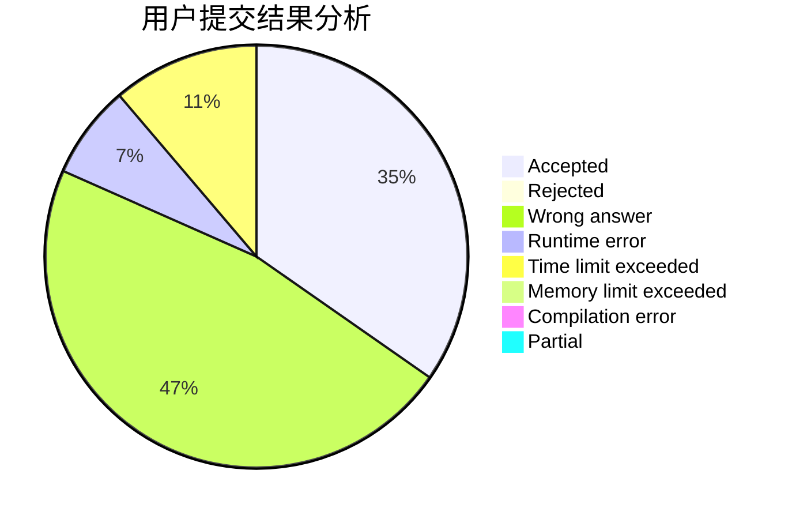
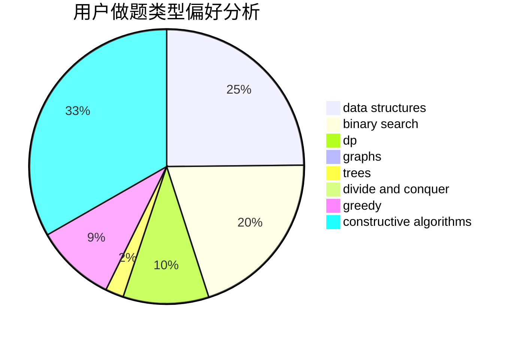

# yuyue

<!-- tabs:start -->

#### **用户提交结果分析**

#### **用户做题类型偏好分析**

#### **用户错题知识点分析**

<!-- tabs:end -->
# 推荐题目
[1416F](https://codeforces.com/contest/1416/problem/F)		flows,
                        graph matchings,
                        greedy,
                        implementation		  
[27C](https://codeforces.com/contest/27/problem/C)		constructive algorithms,
                        greedy		  
[547D](https://codeforces.com/contest/547/problem/D)		constructive algorithms,
                        dfs and similar,
                        graphs		  
[954I](https://codeforces.com/contest/954/problem/I)		fft,
                        math		  
[434A](https://codeforces.com/contest/434/problem/A)		dsu,graphs,sortings,trees		  
[63C](https://codeforces.com/contest/63/problem/C)		brute force,
                        implementation		  
[510D](https://codeforces.com/contest/510/problem/D)		bitmasks,
                        brute force,
                        dp,
                        math		  
[1331C](https://codeforces.com/contest/1331/problem/C)		bitmasks		  
[1301B](https://codeforces.com/contest/1301/problem/B)		binary search,
                        greedy,
                        ternary search		  
[233A](https://codeforces.com/contest/233/problem/A)		implementation,
                        math		  
