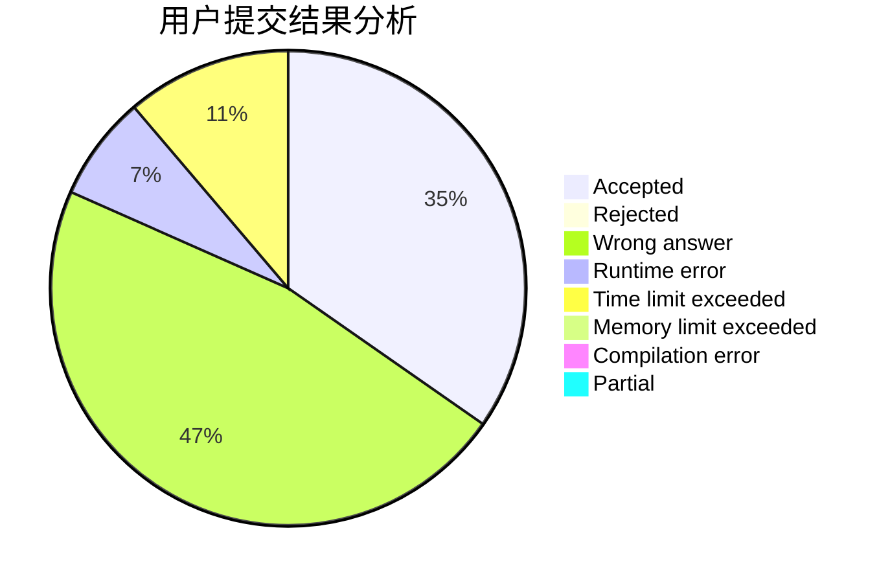
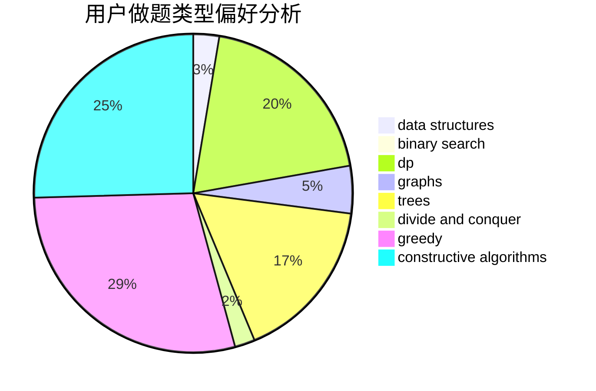

# yuyue

<!-- tabs:start -->

#### **用户提交结果分析**

#### **用户做题类型偏好分析**

#### **用户错题知识点分析**

<!-- tabs:end -->
# 推荐题目
[1424G](https://codeforces.com/contest/1424/problem/G)		data structures,
                        sortings		  
[295B](https://codeforces.com/contest/295/problem/B)		dp,
                        graphs,
                        shortest paths		  
[572A](https://codeforces.com/contest/572/problem/A)		sortings		  
[976F](https://codeforces.com/contest/976/problem/F)		flows,
                        graphs		  
[454A](https://codeforces.com/contest/454/problem/A)		implementation		  
[6701](https://codeforces.com/contest/670/problem/1)		dsu,graphs,sortings,trees		  
[534B](https://codeforces.com/contest/534/problem/B)		dp,
                        greedy,
                        math		  
[1337B](https://codeforces.com/contest/1337/problem/B)		greedy,
                        implementation,
                        math		  
[1310E](https://codeforces.com/contest/1310/problem/E)		dp		  
[255C](https://codeforces.com/contest/255/problem/C)		brute force,
                        dp		  
