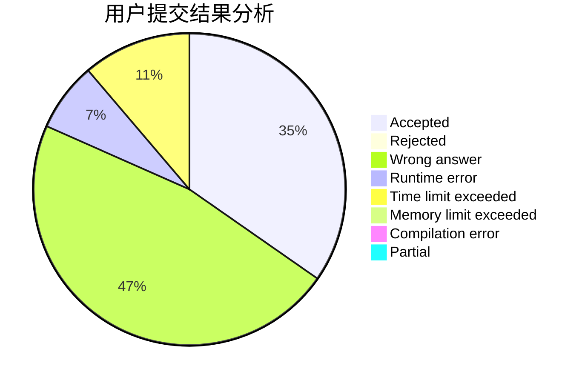
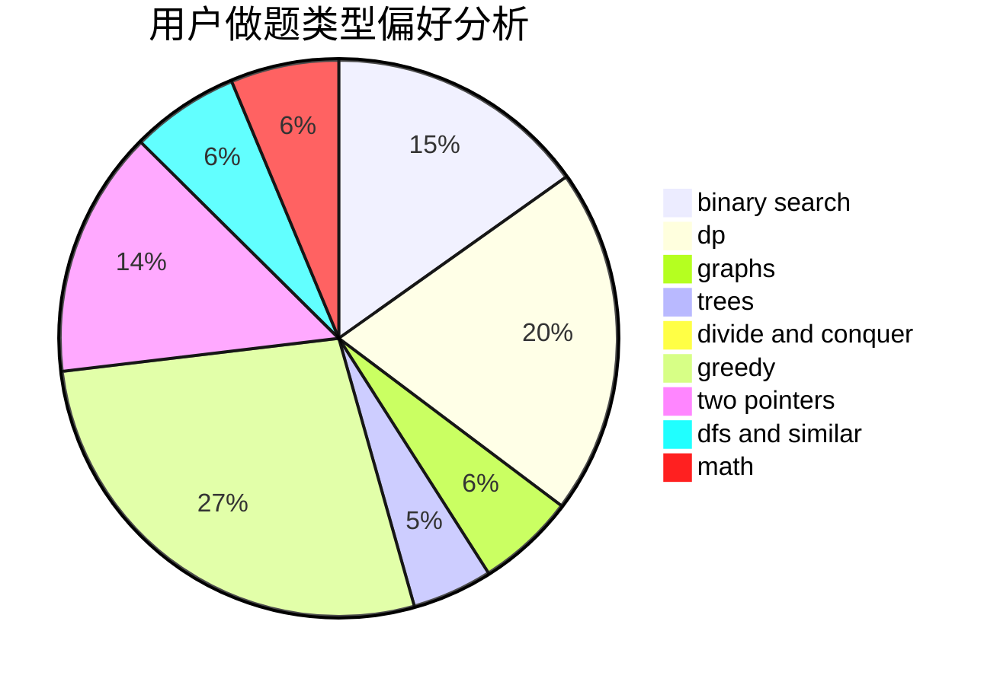

# yuyue

<!-- tabs:start -->

#### **用户提交结果分析**

#### **用户做题类型偏好分析**

<!-- tabs:end -->
# 推荐题目
[1424G](https://codeforces.com/contest/1424/problem/G)
[295B](https://codeforces.com/contest/295/problem/B)
[572A](https://codeforces.com/contest/572/problem/A)
[976F](https://codeforces.com/contest/976/problem/F)
[454A](https://codeforces.com/contest/454/problem/A)
[6701](https://codeforces.com/contest/670/problem/1)
[534B](https://codeforces.com/contest/534/problem/B)
[1337B](https://codeforces.com/contest/1337/problem/B)
[1310E](https://codeforces.com/contest/1310/problem/E)
[255C](https://codeforces.com/contest/255/problem/C)
