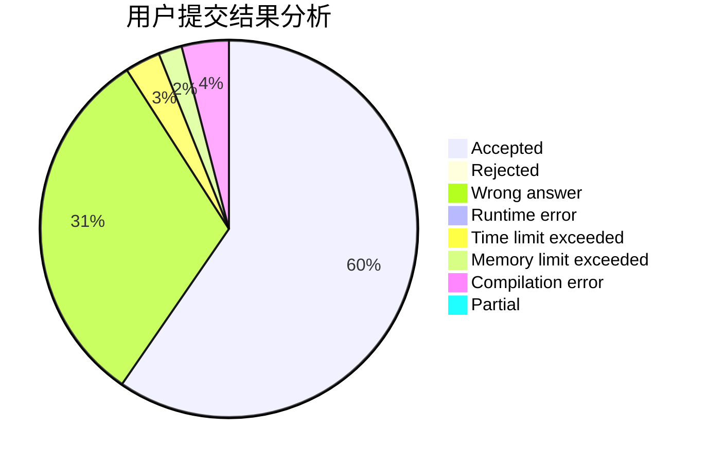
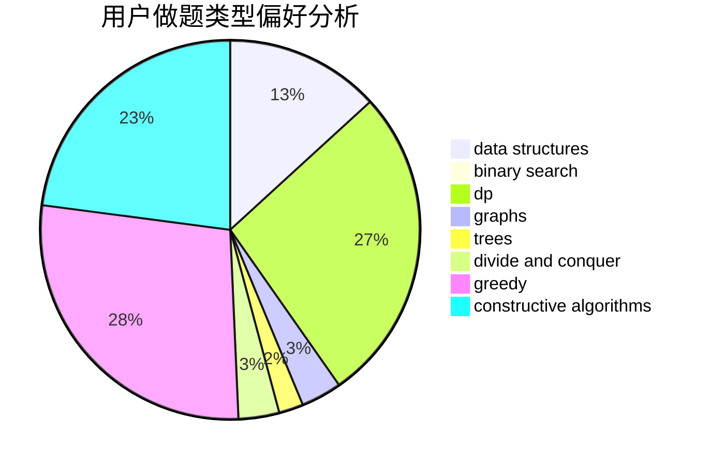
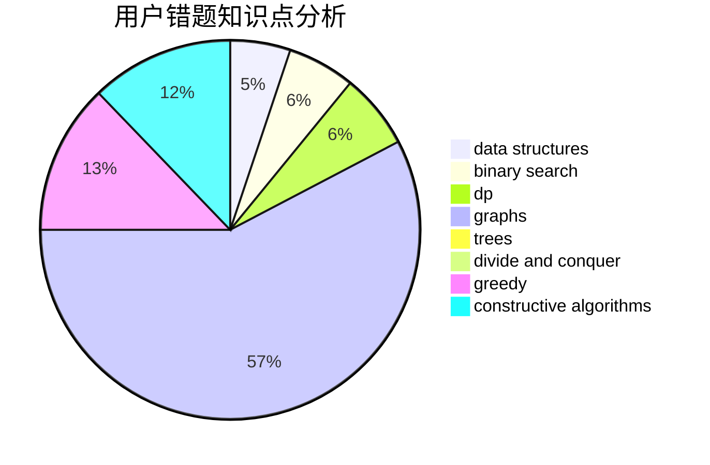

# yuzhechuan

<!-- tabs:start -->

#### **用户提交结果分析**

#### **用户做题类型偏好分析**

#### **用户错题知识点分析**

<!-- tabs:end -->
# 推荐题目
[367B](https://codeforces.com/contest/367/problem/B)		binary search,
                        data structures		  
[1033E](https://codeforces.com/contest/1033/problem/E)		binary search,
                        constructive algorithms,
                        dfs and similar,
                        graphs,
                        interactive		  
[845D](https://codeforces.com/contest/845/problem/D)		data structures,
                        dp,
                        greedy		  
[584C](https://codeforces.com/contest/584/problem/C)		constructive algorithms,
                        greedy,
                        strings		  
[1360E](https://codeforces.com/contest/1360/problem/E)		dp,
                        graphs,
                        implementation,
                        shortest paths		  
[360D](https://codeforces.com/contest/360/problem/D)		number theory		  
[1106C](https://codeforces.com/contest/1106/problem/C)		greedy,
                        implementation,
                        math,
                        sortings		  
[844A](https://codeforces.com/contest/844/problem/A)		greedy,
                        implementation,
                        strings		  
[414E](https://codeforces.com/contest/414/problem/E)		data structures		  
[703E](https://codeforces.com/contest/703/problem/E)		dp,
                        number theory		  
