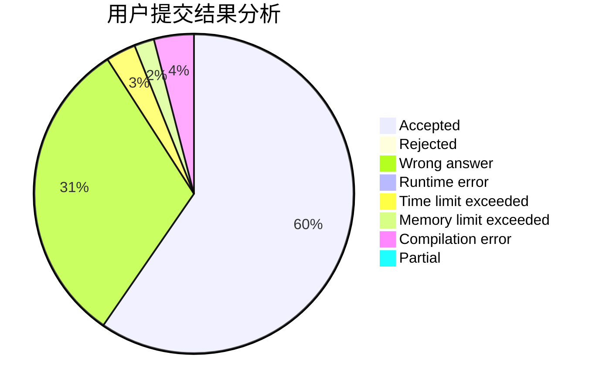
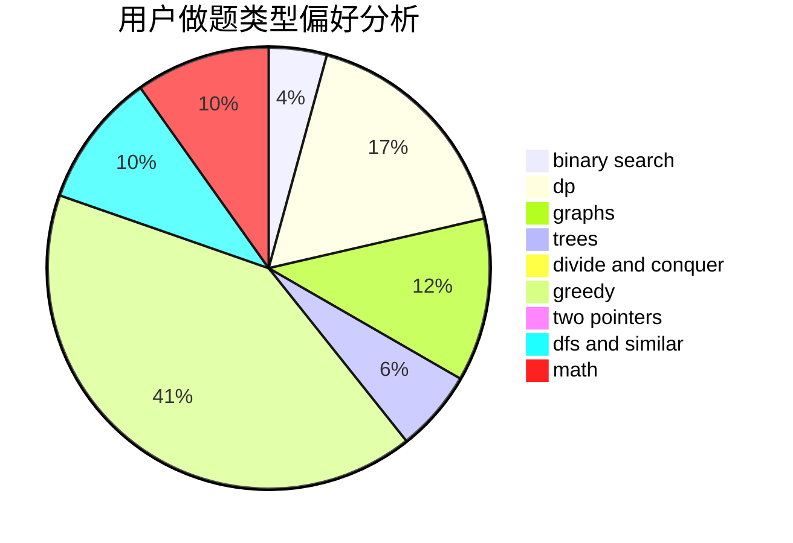

# yuzhechuan

<!-- tabs:start -->

#### **用户提交结果分析**

#### **用户做题类型偏好分析**

<!-- tabs:end -->
# 推荐题目
[367B](https://codeforces.com/contest/367/problem/B)
[1033E](https://codeforces.com/contest/1033/problem/E)
[845D](https://codeforces.com/contest/845/problem/D)
[584C](https://codeforces.com/contest/584/problem/C)
[1360E](https://codeforces.com/contest/1360/problem/E)
[360D](https://codeforces.com/contest/360/problem/D)
[1106C](https://codeforces.com/contest/1106/problem/C)
[844A](https://codeforces.com/contest/844/problem/A)
[414E](https://codeforces.com/contest/414/problem/E)
[703E](https://codeforces.com/contest/703/problem/E)
