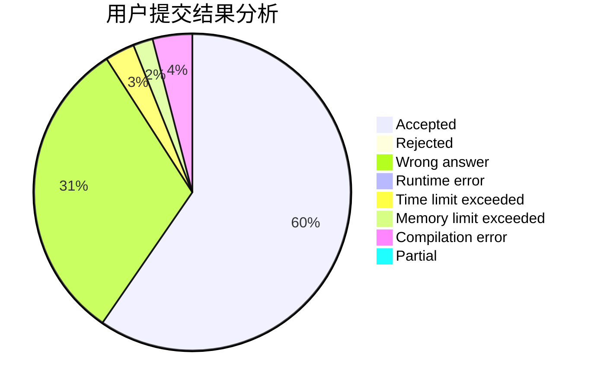
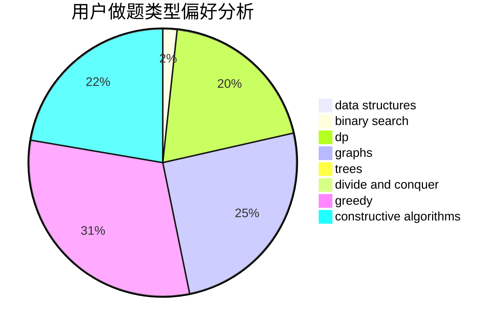
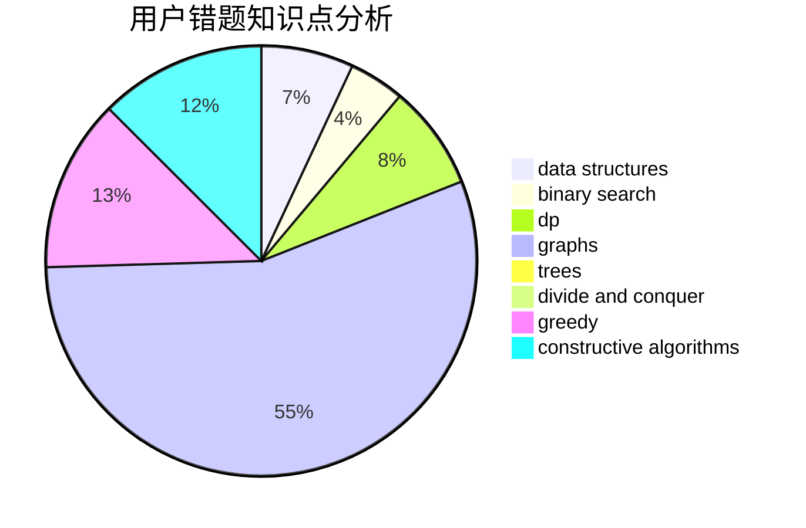

# yuzhechuan

<!-- tabs:start -->

#### **用户提交结果分析**

#### **用户做题类型偏好分析**

#### **用户错题知识点分析**

<!-- tabs:end -->
# 推荐题目
[33A](https://codeforces.com/contest/33/problem/A)		greedy,
                        implementation		  
[1033B](https://codeforces.com/contest/1033/problem/B)		math,
                        number theory		  
[827A](https://codeforces.com/contest/827/problem/A)		data structures,
                        greedy,
                        sortings,
                        strings		  
[560A](https://codeforces.com/contest/560/problem/A)		implementation,
                        sortings		  
[1354A](https://codeforces.com/contest/1354/problem/A)		math		  
[334B](https://codeforces.com/contest/334/problem/B)		sortings		  
[1105E](https://codeforces.com/contest/1105/problem/E)		bitmasks,
                        brute force,
                        dp,
                        meet-in-the-middle		  
[825D](https://codeforces.com/contest/825/problem/D)		binary search,
                        greedy,
                        implementation		  
[383E](https://codeforces.com/contest/383/problem/E)		combinatorics,
                        divide and conquer,
                        dp		  
[67B](https://codeforces.com/contest/67/problem/B)		greedy		  
