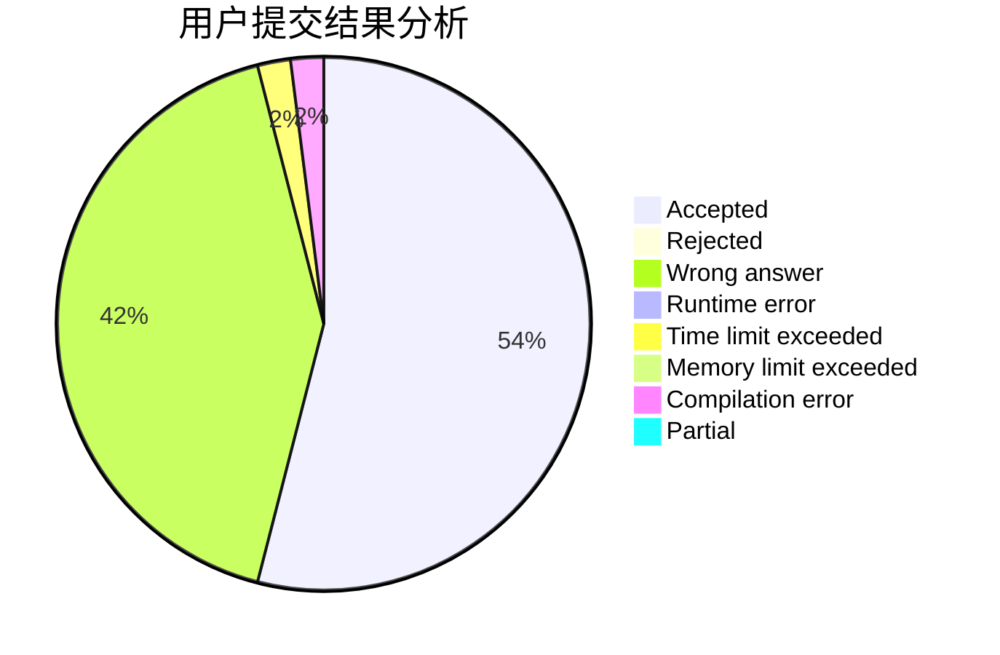
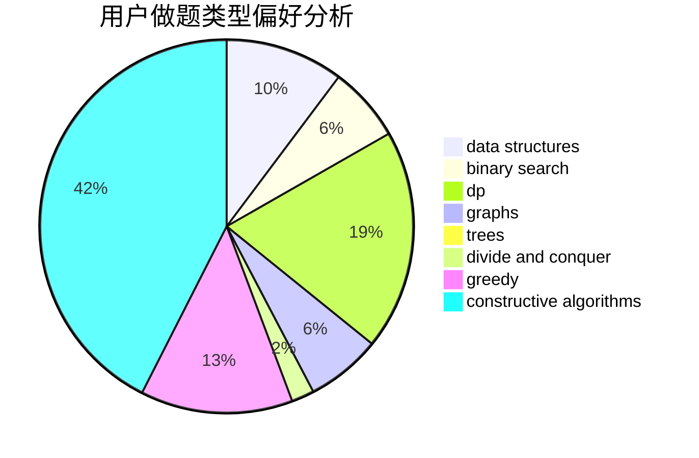
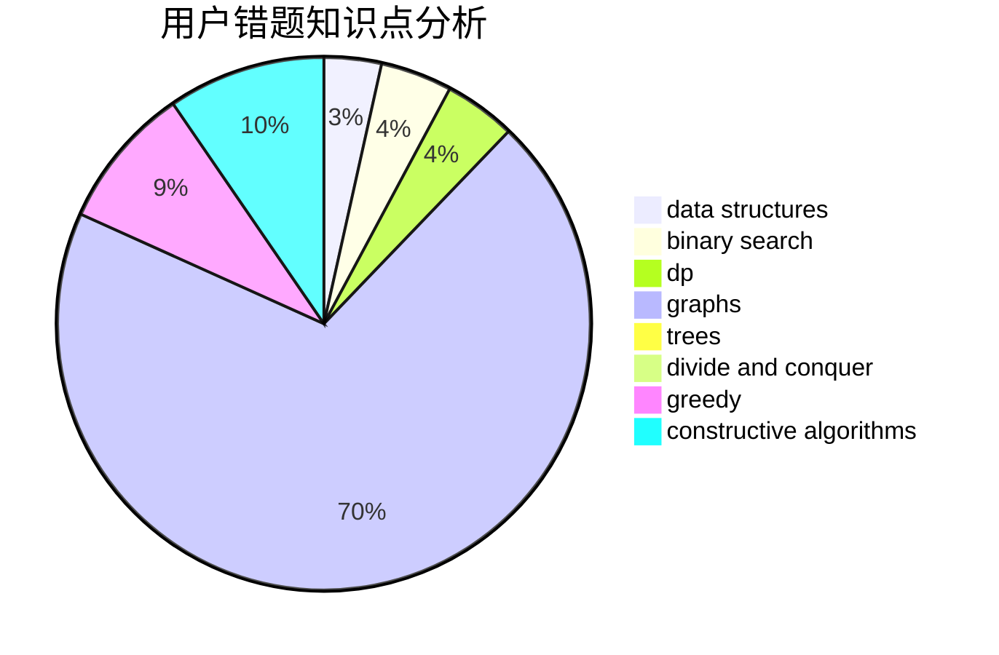

# yx20201301

<!-- tabs:start -->

#### **用户提交结果分析**

#### **用户做题类型偏好分析**

#### **用户错题知识点分析**

<!-- tabs:end -->
# 推荐题目
[1501C](https://codeforces.com/contest/1501/problem/C)		dsu,graphs,sortings,trees		  
[1244G](https://codeforces.com/contest/1244/problem/G)		constructive algorithms,
                        greedy,
                        math		  
[363B](https://codeforces.com/contest/363/problem/B)		brute force,
                        dp		  
[1413C](https://codeforces.com/contest/1413/problem/C)		binary search,
                        brute force,
                        dp,
                        implementation,
                        sortings,
                        two pointers		  
[681B](https://codeforces.com/contest/681/problem/B)		brute force		  
[493E](https://codeforces.com/contest/493/problem/E)		math		  
[1132F](https://codeforces.com/contest/1132/problem/F)		dp		  
[922C](https://codeforces.com/contest/922/problem/C)		brute force,
                        number theory		  
[782C](https://codeforces.com/contest/782/problem/C)		dsu,graphs,sortings,trees		  
[280D](https://codeforces.com/contest/280/problem/D)		data structures,
                        flows,
                        graphs,
                        implementation		  
