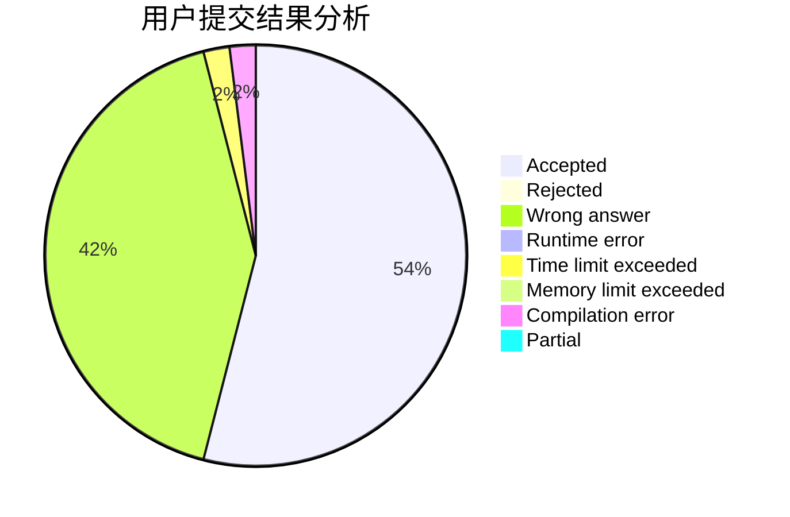
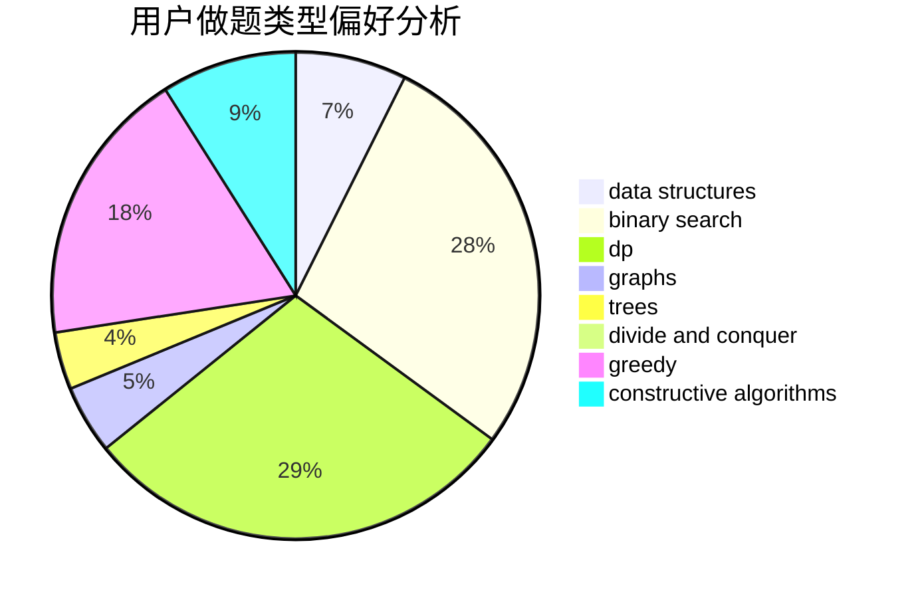
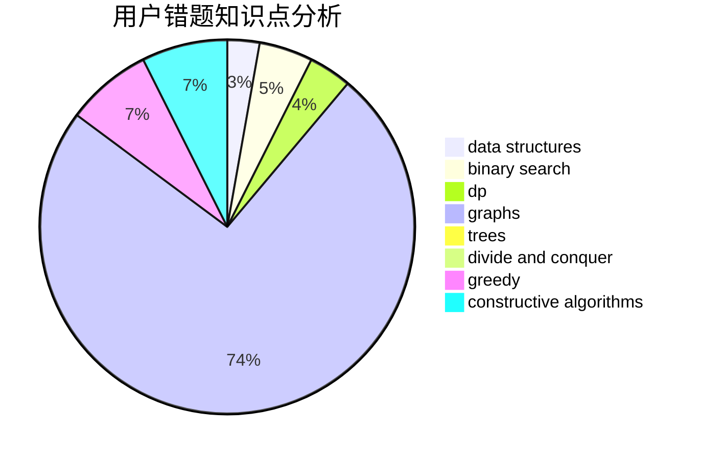

# yx20201301

<!-- tabs:start -->

#### **用户提交结果分析**

#### **用户做题类型偏好分析**

#### **用户错题知识点分析**

<!-- tabs:end -->
# 推荐题目
[1511D](https://codeforces.com/contest/1511/problem/D)		brute force,
                        constructive algorithms,
                        graphs,
                        greedy,
                        strings		  
[1250B](https://codeforces.com/contest/1250/problem/B)		brute force,
                        constructive algorithms,
                        greedy,
                        math		  
[38A](https://codeforces.com/contest/38/problem/A)		implementation		  
[1422E](https://codeforces.com/contest/1422/problem/E)		dp,
                        greedy,
                        implementation,
                        strings		  
[705A](https://codeforces.com/contest/705/problem/A)		implementation		  
[513C](https://codeforces.com/contest/513/problem/C)		bitmasks,
                        probabilities		  
[1136E](https://codeforces.com/contest/1136/problem/E)		binary search,
                        data structures		  
[946C](https://codeforces.com/contest/946/problem/C)		greedy,
                        strings		  
[800B](https://codeforces.com/contest/800/problem/B)		dsu,graphs,sortings,trees		  
[297A](https://codeforces.com/contest/297/problem/A)		constructive algorithms		  
