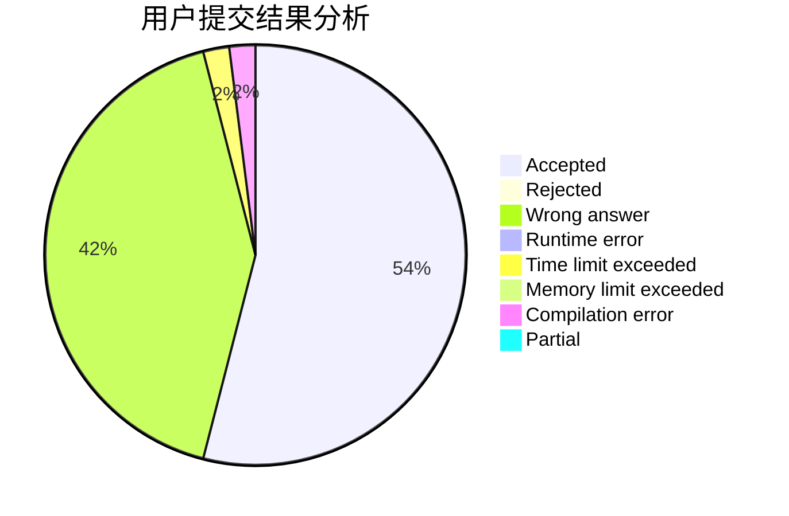
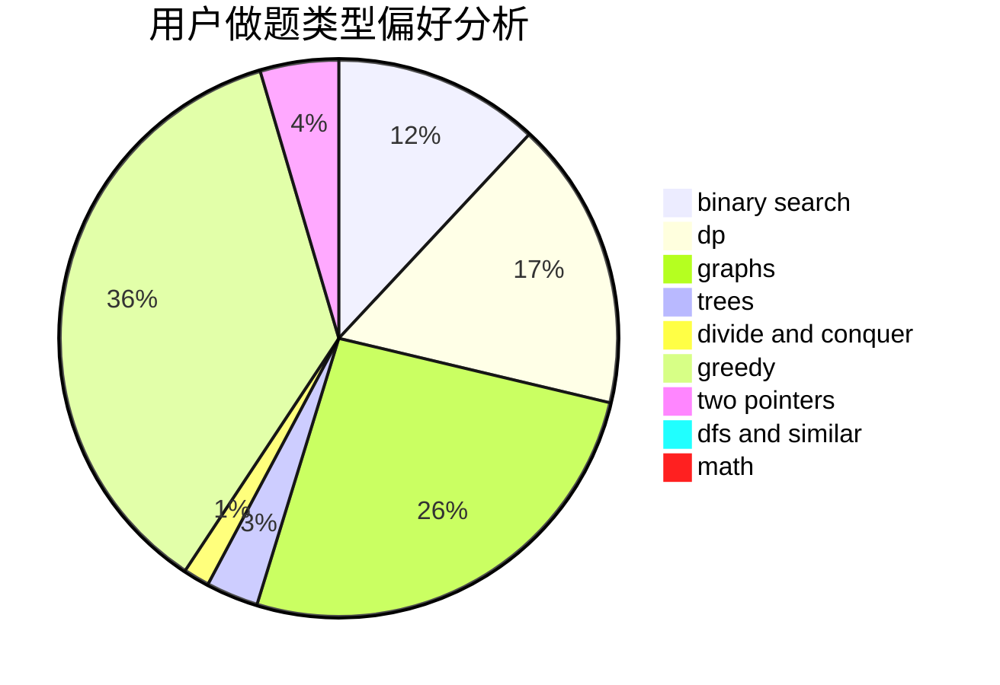

# yx20201301

<!-- tabs:start -->

#### **用户提交结果分析**

#### **用户做题类型偏好分析**

<!-- tabs:end -->
# 推荐题目
[1511D](https://codeforces.com/contest/1511/problem/D)
[1250B](https://codeforces.com/contest/1250/problem/B)
[38A](https://codeforces.com/contest/38/problem/A)
[1422E](https://codeforces.com/contest/1422/problem/E)
[705A](https://codeforces.com/contest/705/problem/A)
[513C](https://codeforces.com/contest/513/problem/C)
[1136E](https://codeforces.com/contest/1136/problem/E)
[946C](https://codeforces.com/contest/946/problem/C)
[800B](https://codeforces.com/contest/800/problem/B)
[297A](https://codeforces.com/contest/297/problem/A)
