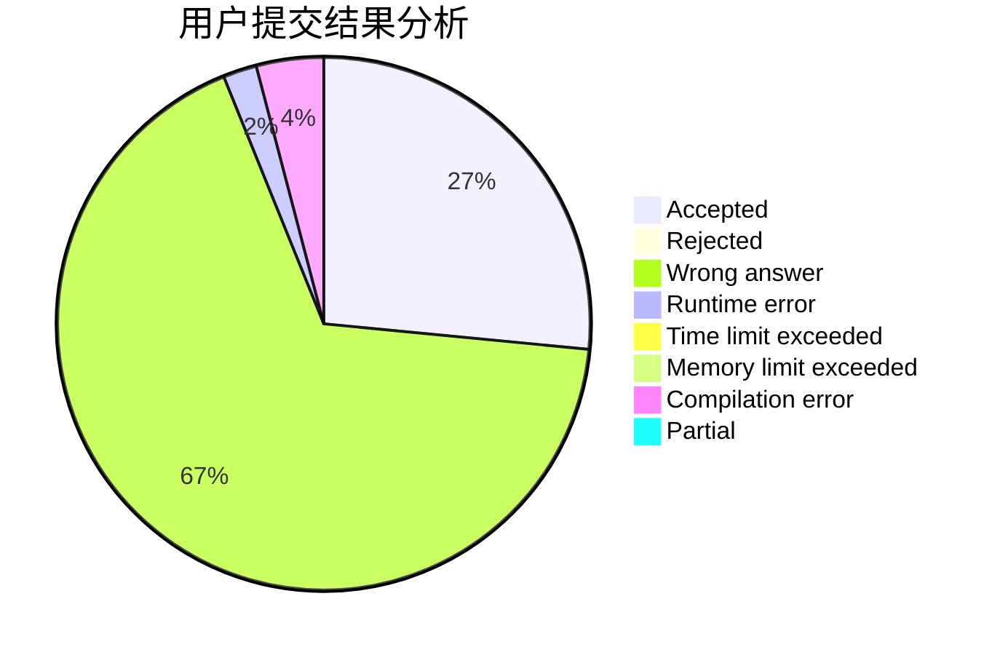
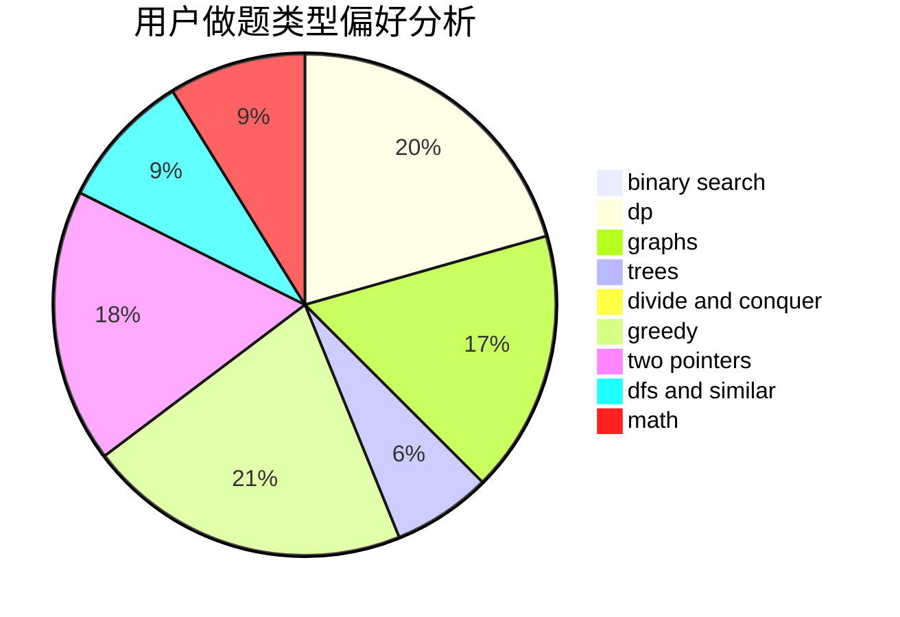

# yxhtxdy

<!-- tabs:start -->

#### **用户提交结果分析**

#### **用户做题类型偏好分析**

<!-- tabs:end -->
# 推荐题目
[204E](https://codeforces.com/contest/204/problem/E)
[38C](https://codeforces.com/contest/38/problem/C)
[784F](https://codeforces.com/contest/784/problem/F)
[780E](https://codeforces.com/contest/780/problem/E)
[1152A](https://codeforces.com/contest/1152/problem/A)
[847B](https://codeforces.com/contest/847/problem/B)
[710E](https://codeforces.com/contest/710/problem/E)
[710B](https://codeforces.com/contest/710/problem/B)
[1165D](https://codeforces.com/contest/1165/problem/D)
[1017E](https://codeforces.com/contest/1017/problem/E)
