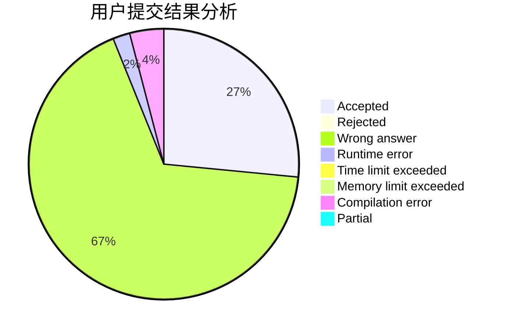
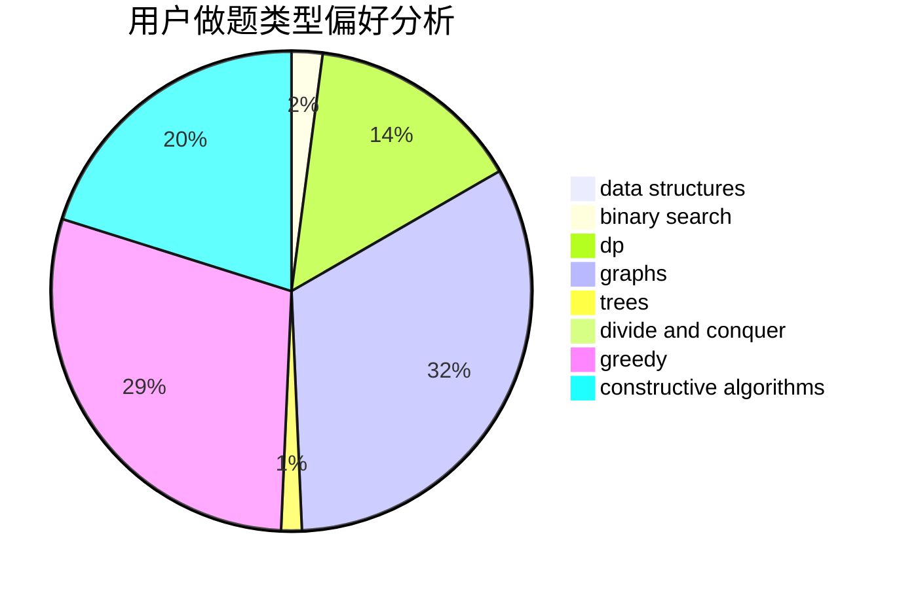
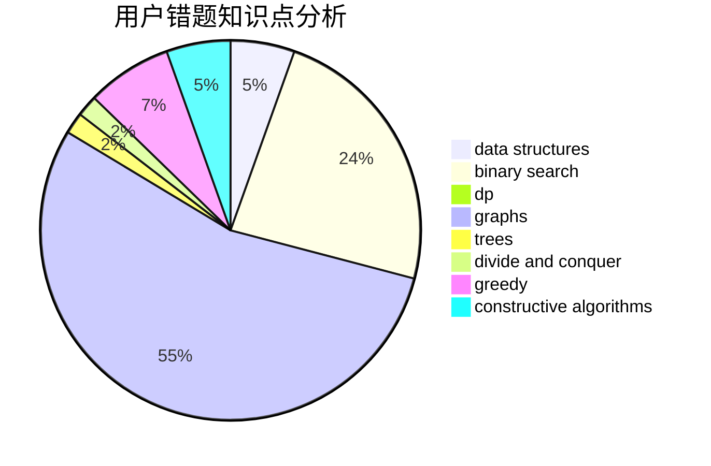

# yxhtxdy

<!-- tabs:start -->

#### **用户提交结果分析**

#### **用户做题类型偏好分析**

#### **用户错题知识点分析**

<!-- tabs:end -->
# 推荐题目
[178F2](https://codeforces.com/contest/178F/problem/2)		dp,
                        sortings,
                        strings		  
[363D](https://codeforces.com/contest/363/problem/D)		binary search,
                        greedy		  
[765C](https://codeforces.com/contest/765/problem/C)		math		  
[762A](https://codeforces.com/contest/762/problem/A)		math,
                        number theory		  
[1150A](https://codeforces.com/contest/1150/problem/A)		greedy,
                        implementation		  
[828D](https://codeforces.com/contest/828/problem/D)		dsu,graphs,sortings,trees		  
[691A](https://codeforces.com/contest/691/problem/A)		implementation		  
[690A1](https://codeforces.com/contest/690A/problem/1)		nan		  
[1164G](https://codeforces.com/contest/1164/problem/G)		dsu,graphs,sortings,trees		  
[1017B](https://codeforces.com/contest/1017/problem/B)		implementation,
                        math		  
