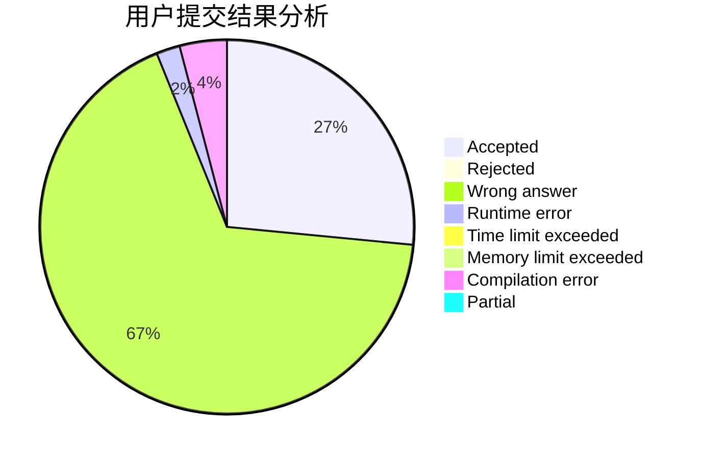
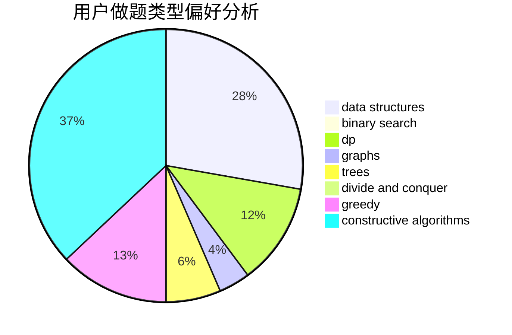
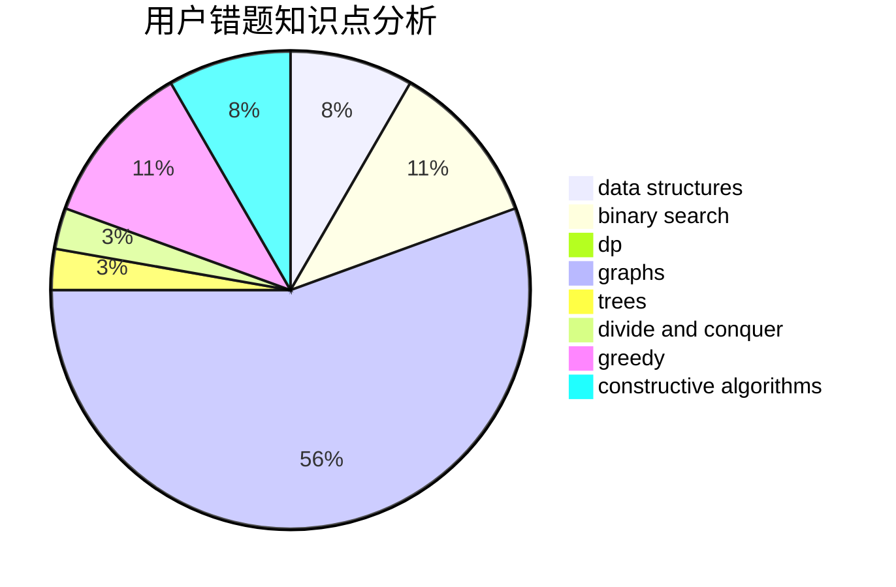

# yxhtxdy

<!-- tabs:start -->

#### **用户提交结果分析**

#### **用户做题类型偏好分析**

#### **用户错题知识点分析**

<!-- tabs:end -->
# 推荐题目
[204E](https://codeforces.com/contest/204/problem/E)		data structures,
                        implementation,
                        string suffix structures,
                        two pointers		  
[38C](https://codeforces.com/contest/38/problem/C)		brute force		  
[784F](https://codeforces.com/contest/784/problem/F)		*special problem,
                        implementation		  
[780E](https://codeforces.com/contest/780/problem/E)		constructive algorithms,
                        dfs and similar,
                        graphs		  
[1152A](https://codeforces.com/contest/1152/problem/A)		greedy,
                        implementation,
                        math		  
[847B](https://codeforces.com/contest/847/problem/B)		binary search,
                        data structures		  
[710E](https://codeforces.com/contest/710/problem/E)		dfs and similar,
                        dp		  
[710B](https://codeforces.com/contest/710/problem/B)		brute force,
                        sortings		  
[1165D](https://codeforces.com/contest/1165/problem/D)		math,
                        number theory		  
[1017E](https://codeforces.com/contest/1017/problem/E)		geometry,
                        hashing,
                        strings		  
