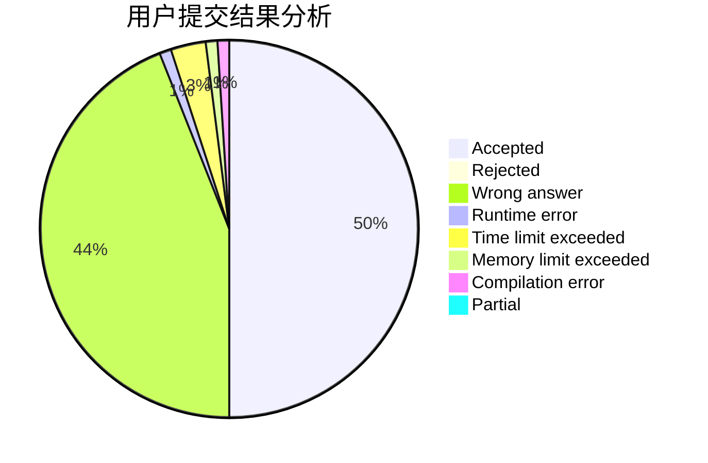
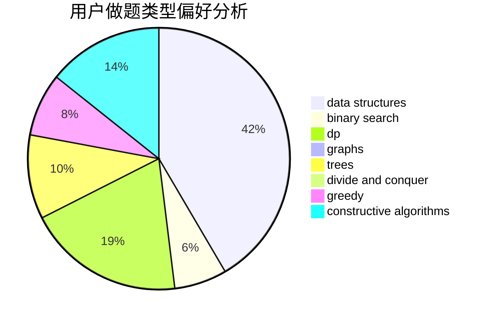
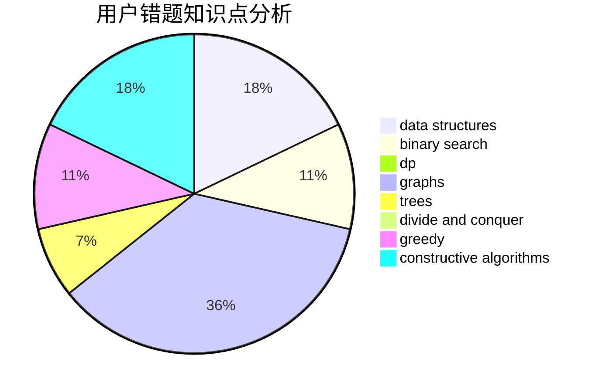

# yxqkhsyh

<!-- tabs:start -->

#### **用户提交结果分析**

#### **用户做题类型偏好分析**

#### **用户错题知识点分析**

<!-- tabs:end -->
# 推荐题目
[1424M](https://codeforces.com/contest/1424/problem/M)		graphs,
                        sortings		  
[808F](https://codeforces.com/contest/808/problem/F)		binary search,
                        flows,
                        graphs		  
[1044D](https://codeforces.com/contest/1044/problem/D)		data structures,
                        dsu		  
[711C](https://codeforces.com/contest/711/problem/C)		dp		  
[1089D](https://codeforces.com/contest/1089/problem/D)		graphs		  
[483D](https://codeforces.com/contest/483/problem/D)		dsu,graphs,sortings,trees		  
[990A](https://codeforces.com/contest/990/problem/A)		implementation,
                        math		  
[1008D](https://codeforces.com/contest/1008/problem/D)		dsu,graphs,sortings,trees		  
[1361E](https://codeforces.com/contest/1361/problem/E)		dfs and similar,
                        graphs,
                        probabilities,
                        trees		  
[1341D](https://codeforces.com/contest/1341/problem/D)		dsu,graphs,sortings,trees		  
