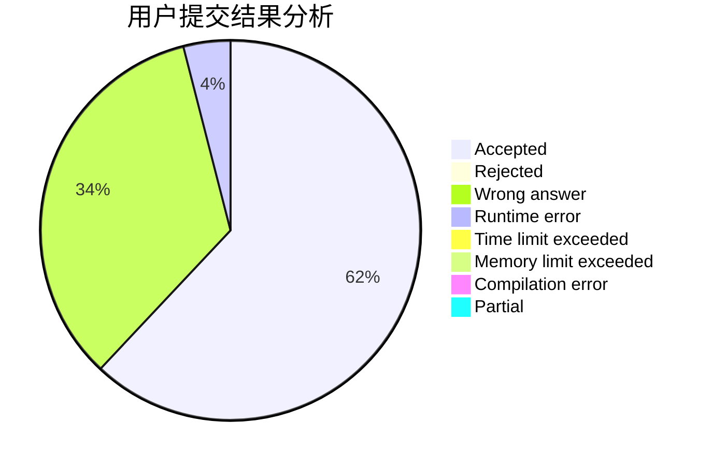
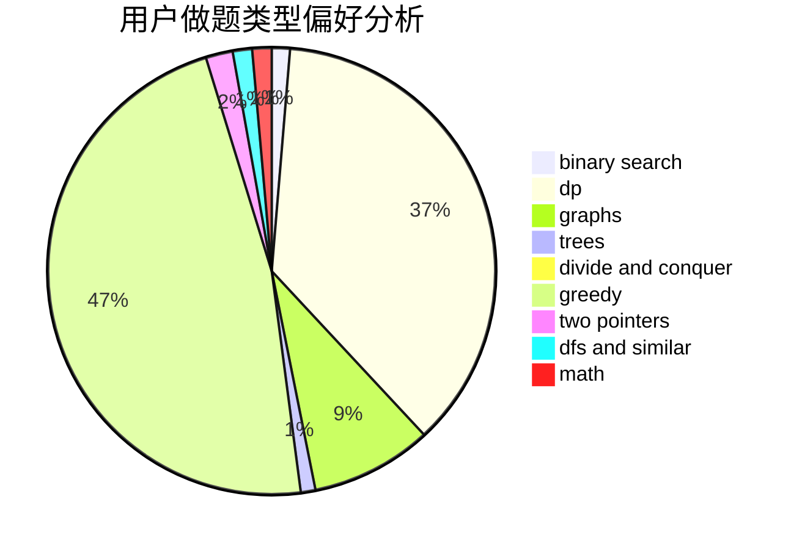

# yycdxp

<!-- tabs:start -->

#### **用户提交结果分析**

#### **用户做题类型偏好分析**

<!-- tabs:end -->
# 推荐题目
[17E](https://codeforces.com/contest/17/problem/E)
[13132](https://codeforces.com/contest/1313/problem/2)
[1140D](https://codeforces.com/contest/1140/problem/D)
[802N](https://codeforces.com/contest/802/problem/N)
[680B](https://codeforces.com/contest/680/problem/B)
[580B](https://codeforces.com/contest/580/problem/B)
[1164P](https://codeforces.com/contest/1164/problem/P)
[15A](https://codeforces.com/contest/15/problem/A)
[62A](https://codeforces.com/contest/62/problem/A)
[676A](https://codeforces.com/contest/676/problem/A)
