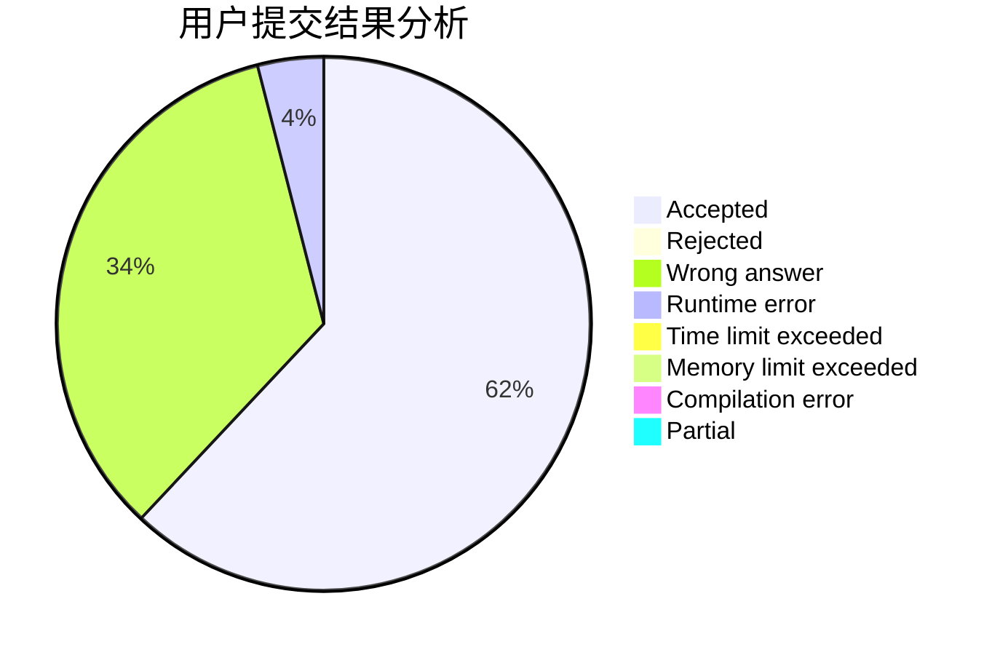
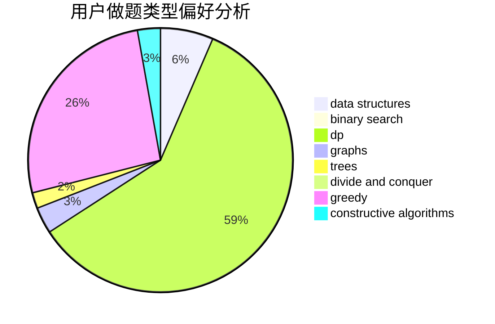
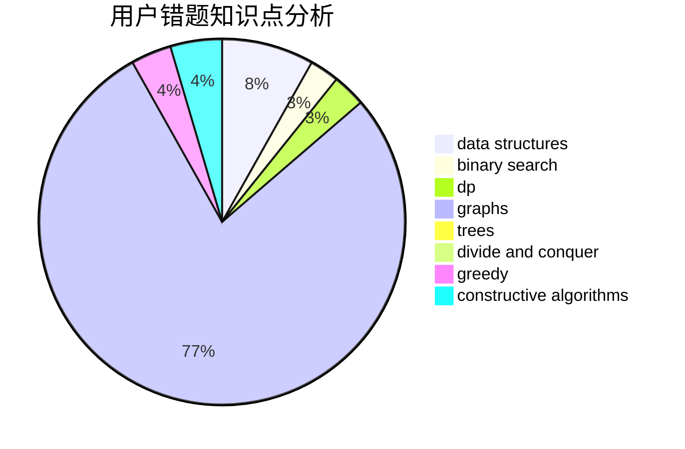

# yycdxp

<!-- tabs:start -->

#### **用户提交结果分析**

#### **用户做题类型偏好分析**

#### **用户错题知识点分析**

<!-- tabs:end -->
# 推荐题目
[17E](https://codeforces.com/contest/17/problem/E)		strings		  
[13132](https://codeforces.com/contest/1313/problem/2)		dsu,graphs,sortings,trees		  
[1140D](https://codeforces.com/contest/1140/problem/D)		dp,
                        greedy,
                        math		  
[802N](https://codeforces.com/contest/802/problem/N)		binary search,
                        flows,
                        graphs		  
[680B](https://codeforces.com/contest/680/problem/B)		constructive algorithms,
                        implementation		  
[580B](https://codeforces.com/contest/580/problem/B)		binary search,
                        sortings,
                        two pointers		  
[1164P](https://codeforces.com/contest/1164/problem/P)		dsu,graphs,sortings,trees		  
[15A](https://codeforces.com/contest/15/problem/A)		implementation,
                        sortings		  
[62A](https://codeforces.com/contest/62/problem/A)		greedy,
                        math		  
[676A](https://codeforces.com/contest/676/problem/A)		constructive algorithms,
                        implementation		  
