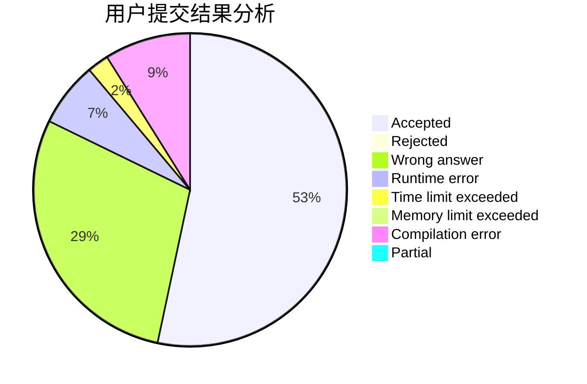
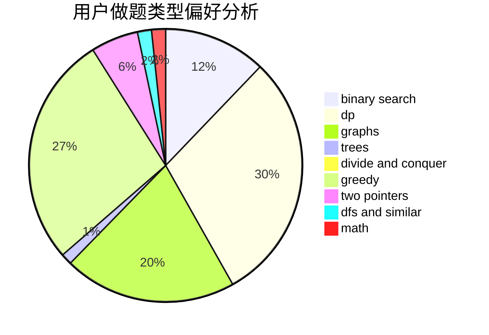

# yyckkkkkkkkkkkkkkkkkkkjm

<!-- tabs:start -->

#### **用户提交结果分析**

#### **用户做题类型偏好分析**

<!-- tabs:end -->
# 推荐题目
[1505I](https://codeforces.com/contest/1505/problem/I)
[14512](https://codeforces.com/contest/1451/problem/2)
[1397D](https://codeforces.com/contest/1397/problem/D)
[1207A](https://codeforces.com/contest/1207/problem/A)
[912E](https://codeforces.com/contest/912/problem/E)
[1350D](https://codeforces.com/contest/1350/problem/D)
[1772](https://codeforces.com/contest/177/problem/2)
[463C](https://codeforces.com/contest/463/problem/C)
[1329C](https://codeforces.com/contest/1329/problem/C)
[821D](https://codeforces.com/contest/821/problem/D)
