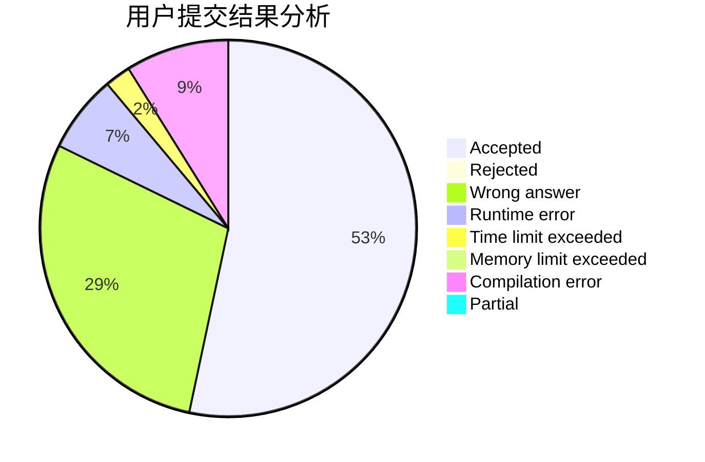
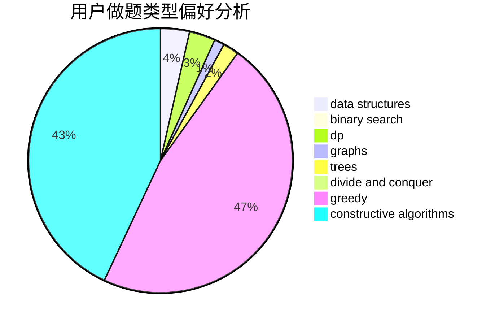
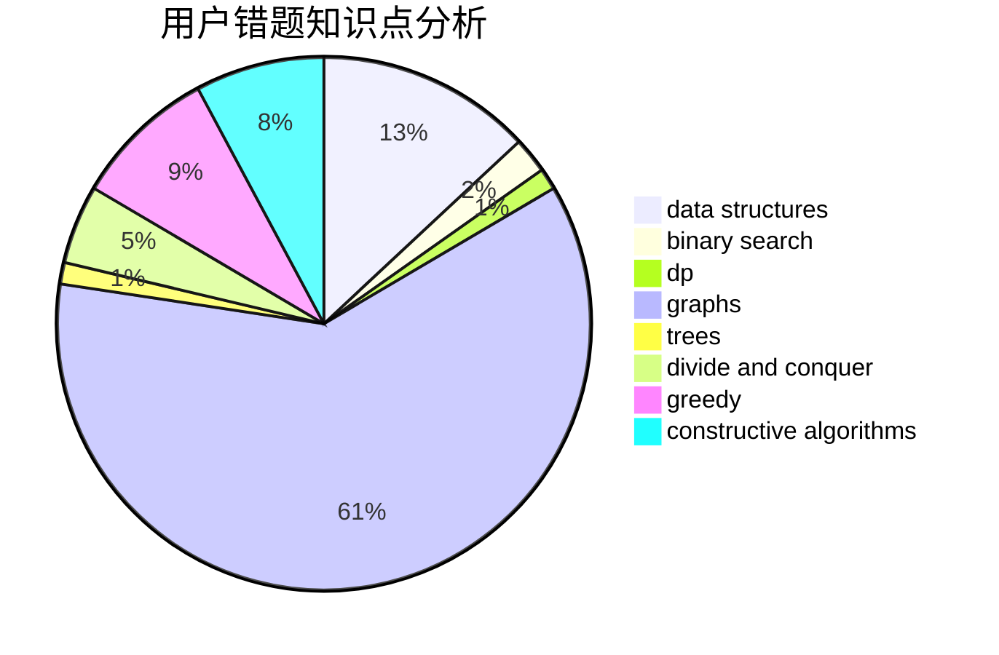

# yyckkkkkkkkkkkkkkkkkkkjm

<!-- tabs:start -->

#### **用户提交结果分析**

#### **用户做题类型偏好分析**

#### **用户错题知识点分析**

<!-- tabs:end -->
# 推荐题目
[1497C1](https://codeforces.com/contest/1497C/problem/1)		constructive algorithms,
                        math		  
[1440B](https://codeforces.com/contest/1440/problem/B)		greedy,
                        math		  
[1388A](https://codeforces.com/contest/1388/problem/A)		brute force,
                        greedy,
                        math,
                        number theory		  
[1202C](https://codeforces.com/contest/1202/problem/C)		brute force,
                        data structures,
                        dp,
                        greedy,
                        implementation,
                        math,
                        strings		  
[895B](https://codeforces.com/contest/895/problem/B)		binary search,
                        math,
                        sortings,
                        two pointers		  
[1343F](https://codeforces.com/contest/1343/problem/F)		brute force,
                        constructive algorithms,
                        data structures,
                        greedy,
                        implementation		  
[156D](https://codeforces.com/contest/156/problem/D)		combinatorics,
                        graphs		  
[442E](https://codeforces.com/contest/442/problem/E)		geometry		  
[1322D](https://codeforces.com/contest/1322/problem/D)		bitmasks,
                        dp		  
[805C](https://codeforces.com/contest/805/problem/C)		dsu,graphs,sortings,trees		  
