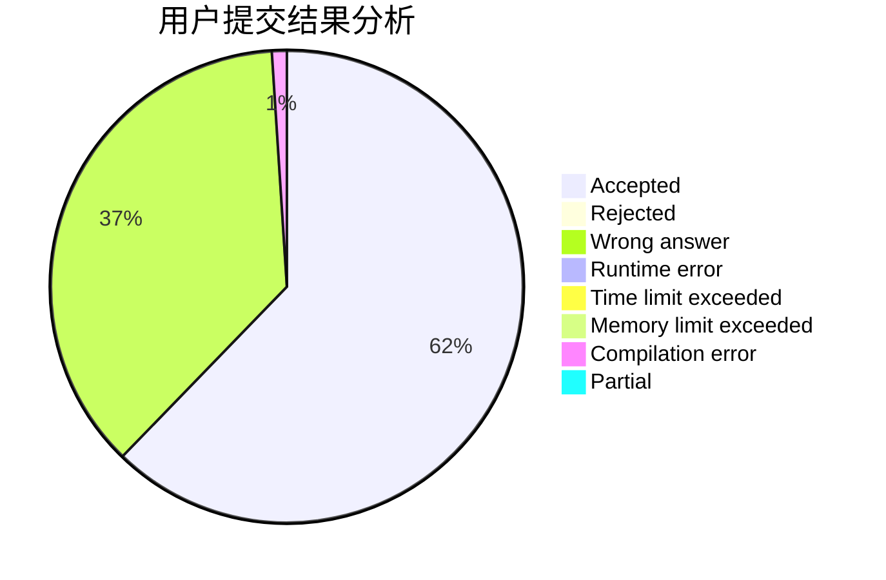
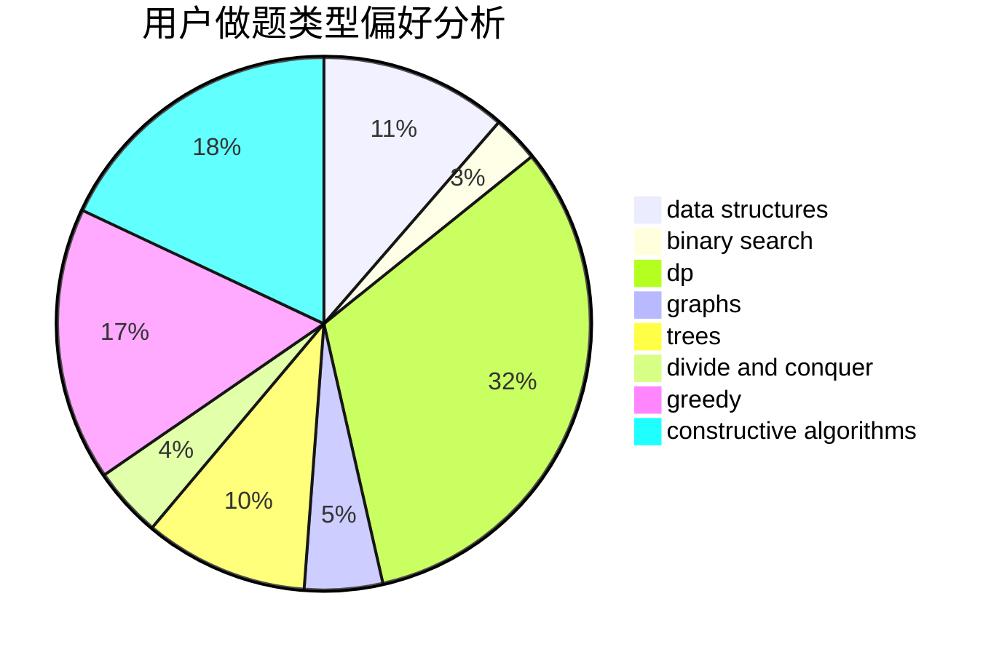
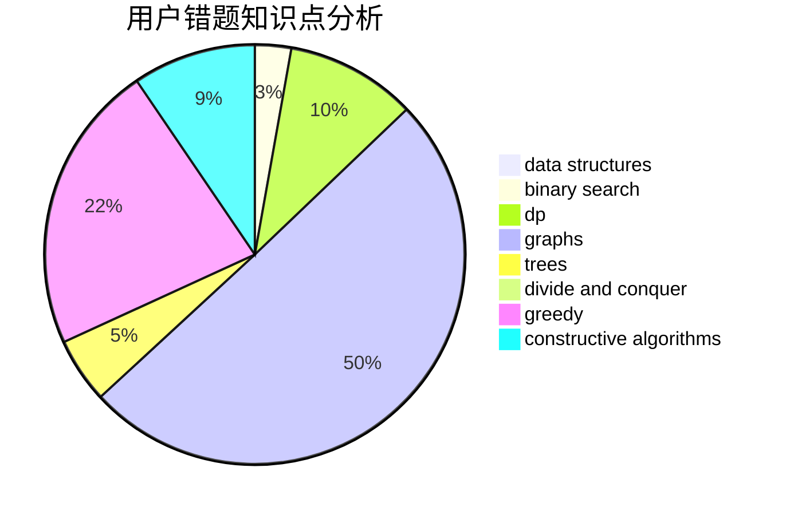

# yyyg

<!-- tabs:start -->

#### **用户提交结果分析**

#### **用户做题类型偏好分析**

#### **用户错题知识点分析**

<!-- tabs:end -->
# 推荐题目
[1301C](https://codeforces.com/contest/1301/problem/C)		binary search,
                        combinatorics,
                        greedy,
                        math,
                        strings		  
[1059B](https://codeforces.com/contest/1059/problem/B)		implementation		  
[716B](https://codeforces.com/contest/716/problem/B)		greedy,
                        two pointers		  
[699C](https://codeforces.com/contest/699/problem/C)		dsu,graphs,sortings,trees		  
[218C](https://codeforces.com/contest/218/problem/C)		dsu,graphs,sortings,trees		  
[494E](https://codeforces.com/contest/494/problem/E)		data structures,
                        games		  
[745C](https://codeforces.com/contest/745/problem/C)		dsu,graphs,sortings,trees		  
[793G](https://codeforces.com/contest/793/problem/G)		data structures,
                        divide and conquer,
                        flows,
                        graph matchings		  
[897C](https://codeforces.com/contest/897/problem/C)		dsu,graphs,sortings,trees		  
[877B](https://codeforces.com/contest/877/problem/B)		brute force,
                        dp		  
